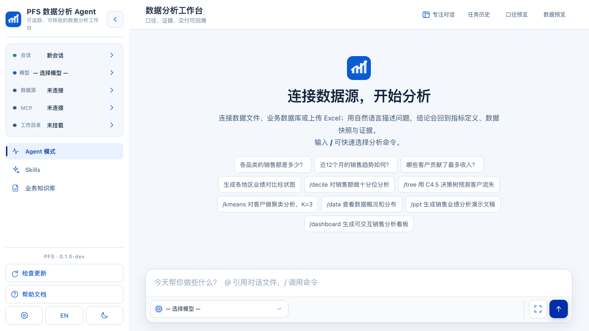

<p align="right"><a href="./README_EN.md">English</a></p>

<p align="center">
  
</p>

<h1 align="center">PFS 数据分析 Agent</h1>

<p align="center">一款本地智能分析工作台</p>

<p align="center">
  连接文件、数据库或受控数据源，用自然语言提出问题，执行有边界的分析，生成图表和交付物，并回看每次运行。
</p>

<p align="center">
  
  
  
  
</p>

<p align="center">
  <a href="#highlights">✨ 项目亮点</a> ·
  <a href="#capabilities">🧠 核心能力</a> ·
  <a href="#quick-start">⚡ 快速开始</a> ·
  <a href="#examples">📊 使用示例</a> ·
  <a href="#models">🤖 模型</a> ·
  <a href="#faq">❓ FAQ</a>
</p>

> 当前版本：`0.1.1`。当前正式版以本地桌面运行、结构化数据分析和跨平台启动为重点。

PFS 支持自然语言分析、受控数据查询、图表生成、多格式报告交付和结果历史回看。

## 项目亮点

- **自然语言分析**：从问题开始，不要求用户先写 SQL。
- **受控数据访问**：先查看字段、范围和数据质量，再执行只读查询与分析。
- **结果可回看**：保留运行状态、数据来源、轻量结论留痕、交付物元数据和下载记录。
- **图表与交付**：支持图表、看板、JSON、CSV、Excel、Word 和 PPT 等结果形式。
- **本地优先**：提供 macOS 和 Windows 启动入口，数据与配置由本地环境管理。
- **可扩展**：模型、Skills、知识库、工作区、Workflow 和可选外部连接按需启用。

## 核心能力

| 类别     | 能力                                                                                 |
| -------- | ------------------------------------------------------------------------------------ |
| 数据接入 | CSV/XLSX 上传、SQLite/MySQL/PostgreSQL/SQL Server 连接入口、受控 HTTP 数据源         |
| 数据理解 | 表和字段预览、数据范围、缺失与重复提示、来源快照                                     |
| 分析执行 | 只读 SQL、分组统计、安全聚合、异常检测、聚类、决策树和时间序列分析入口               |
| 可视化   | 图表推荐、交互式图表和 Dashboard 交付入口                                            |
| Agent    | SSE 对话、工具调用、Skills、知识库、Workflow、任务状态和上下文管理                   |
| 协作扩展 | 保留 MCP、Teams、Hooks、飞书和云端登录扩展入口；MCP/Teams/Hooks/飞书入口默认可用，云端登录与 GPU/远程执行默认关闭 |

## 快速演示

1. 启动 PFS，打开 `http://127.0.0.1:5001`。
2. 新建会话，上传 `data/fixtures/pfs_sales.csv`。
3. 选择数据表，查看字段、行数、时间范围和分组维度。
4. 输入：`按地区汇总销售额，并说明哪个地区最高。`
5. 查看结果和图表，再下载 JSON 或 CSV。

仓库内置样例包含 9 行数据、3 个月、3 个地区，销售额合计为 `100,000`。这条确定性演示不依赖外部模型；配置模型后，可以继续体验更开放的 Agent 分析流程。

## 界面预览

下面是当前真实 Flask 工作台的桌面入口。截图来自隔离本地服务的 `1280×720` 视口；根目录 `index.html` 仍是静态设计预览，不代表实际应用入口。



展示路径：启动 → 上传 `data/fixtures/pfs_sales.csv` → 打开“口径预览” → 运行分析 → 查看结果摘要与来源快照 → 生成交付物 → 在任务历史回看。

## 快速开始

需要 Python 3.10+。进入项目目录后执行对应系统的入口：

```bash
# macOS
./install.sh
./start.command
```

```powershell
# Windows PowerShell
powershell -ExecutionPolicy Bypass -File .\install.ps1
.\start.bat
```

然后访问 `http://127.0.0.1:5001`。普通用户不需要安装 Docker。

已完成依赖安装时，也可以直接运行：

```bash
python app.py
```

### Docker

Docker 用于开发环境、镜像验证和部署尝试：

```bash
docker build -t pfs-data-analysis-agent:local .
docker run --rm -p 5001:5001 pfs-data-analysis-agent:local
```

不要把 API Key 写入 Dockerfile、镜像或 Git。需要队列 worker 时，参见仓库内的 `docker-compose.yml` 和对应环境配置。

## 文档

- [产品说明](PRODUCT.md)：产品定位、能力范围、界面和运行方式
- [使用说明](Information/Instruction.md)：从数据接入到结果核验
- [知识库使用说明](Information/repository_tutorial.md)：管理业务背景和分析规则
- [MCP 使用说明](Information/MCP_tutorial.md)：配置可选外部工具连接
- [版本更新日志](Information/Version_Update_Log.md)
- [许可证](LICENSE) · [安全策略](SECURITY.md) · [权利与第三方说明](NOTICE.md)

## 斜杠命令

| 命令         | 作用                         |
| ------------ | ---------------------------- |
| `/new`       | 新建分析会话                 |
| `/sessions`  | 查看或刷新已保存会话         |
| `/data`      | 打开数据预览和表选择         |
| `/status`    | 查看模型、数据源和上下文状态 |
| `/jobs`      | 查看任务历史和运行状态       |
| `/skills`    | 查看或选择 Skills            |
| `/knowledge` | 打开知识库                   |
| `/mcp`       | 管理 MCP 连接和工具          |
| `/workspace` | 管理工作目录和权限           |
| `/stop`      | 停止当前回复                 |
| `/compact`   | 压缩当前对话上下文           |
| `/help`      | 查看命令帮助                 |

`/teams` 和 `/robot` 是可选扩展入口。是否连接外部服务取决于目标环境、凭据和用户主动配置；没有目标和凭据时不会自动发起外部调用。

## 使用示例

### 区域数据分析

```text
按地区汇总销售额，找出最高地区，并给出一张适合分享的图表。
```

系统会先读取字段和范围，再执行受控查询，输出分组结果、图表建议和来源信息。

### 数据质量检查

```text
检查这份数据的缺失值、重复记录、日期范围和异常金额，并说明哪些问题会影响结论。
```

数据质量提示与分析结果分开呈现；原始记录不会被静默删除，待确认项也不会被伪装成结论。

### 生成交付物

```text
把本次分析整理成 Excel 和 PPT，并保留数据来源、分析口径和最终结论。
```

交付物会登记到当前会话，保留来源和运行信息。复杂文件内容和跨平台视觉效果应在目标环境中单独检查。

## 模型

公共内置模型目录为：

- DeepSeek
- Kimi 与 Kimi Coding Plan
- GLM 与 GLM Coding Plan
- MiniMax 与 MiniMax Coding Plan
- 自定义 OpenAI-compatible 模型

模型密钥只应放在本地配置或环境变量中，不要写入仓库。旧配置中的其他 provider 不属于默认模型目录。

## 版本与平台边界

当前版本面向 Windows x64 和 macOS Apple Silicon 的本地运行，不提供 macOS Intel 安装包。正式安装包和版本号以 [GitHub Releases](https://github.com/hlc1991/PFS-data-analysis-agent/releases) 页面为准。

商业画布与 Google Sheets 不属于当前产品范围。MCP、Teams、Hooks 和飞书保留为可选扩展入口；云端登录与 GPU/远程执行入口保留但默认关闭，需要用户明确配置后才会尝试运行。

当前版本面向结构化数据文件和数据库连接，不提供图片上传或视觉分析能力。模型、数据库、外部服务和本地依赖的实际可用性取决于运行环境，固定样例不能替代真实数据核验。

## 目录

```text
app.py                 应用启动入口
api/                   HTTP、SSE、工作区、任务和系统接口
agent/                 Agent Loop、工具、Skills、Workflow 和扩展
data/                  会话、工作区、数据源和运行状态
Function/              分析、清洗、图表和交付物实现
pfs_agent/             PFS 分析契约与确定性策略
frontend/              前端模块和构建入口
templates/             服务端页面
static/                样式、图标和构建资源
tests/                 契约、适配层和分析回归测试
```

## 开发检查

```bash
pnpm run quality
git diff --check
```

如需分别执行检查：

```bash
PYTHONDONTWRITEBYTECODE=1 .venv/bin/python -B -m unittest discover -s tests -p 'test_*.py' -q
.venv/bin/ruff check .
pnpm run format:check
pnpm run lint
pnpm run build:check
git diff --check
```

## 常见问题

<details>
<summary>这是云端 SaaS 还是本地 Agent？</summary>

当前交付以桌面本地工作台为主。云端登录、部署和线上地址属于可选扩展，不能因为仓库存在相关配置就视为线上服务已经可用。
</details>

<details>
<summary>普通用户需要 Docker 吗？</summary>

不需要。使用安装脚本和启动脚本即可；Docker 主要用于开发、镜像验证和部署尝试。
</details>

<details>
<summary>数据和密钥会提交到仓库吗？</summary>

不会。不要提交 `.env`、API Key、`secret_key`、SQLite 运行时文件、上传数据、生成产物或 `node_modules`。
</details>

## 权利与安全

本仓库采用 [`LICENSE`](LICENSE) 中的自定义非商业许可：注明出处后可学习、研究、非商业使用、修改和再分发；商业用途须事先取得著作权人的书面授权。软件、依赖、字体、图标和其他材料仍分别受适用的版权、许可证或书面授权约束，使用和再分发前请阅读 [`NOTICE.md`](NOTICE.md)。安全问题请参见 [`SECURITY.md`](SECURITY.md)。
