# PFS 数据分析 Agent 产品说明书

### 1.1 业务现状

企业业务部门日常需要持续处理结构化数据、经营数据和专题资料。数据通常来自邮件、共享目录、办公系统导出的文件或已配置的数据源，分析人员需要围绕这些数据完成指标监测、趋势比较、异常发现、原因研判、维度下钻和分析材料编制。

当前典型工作链路如下：

1. 从邮件、共享目录或办公系统获取数据文件；
2. 打开多份 CSV、Excel 或其他数据文件，确认字段和指标含义；
3. 通过筛选、复制、公式、透视表或脚本完成整理和计算；
4. 比较本期与上期、实际与目标以及不同区域、产品、客户或渠道之间的差异；
5. 对异常指标继续下钻，结合业务经验判断可能原因；
6. 将结论整理为图表、邮件、周报、专题材料或其他交付文件；
7. 将结果用于管理沟通，并在下一周期重复相似过程。

这类工作不一定需要复杂的数据科学模型，但需要把数据理解、口径确认、查询计算、结果解释和材料交付串成完整流程。正式应用时，可通过任务记录持续观察实际耗时、人工步骤和结果修改次数。

### 1.2 面临问题

| 优先级 | 问题 | 具体表现 | 对业务的影响 |
| --- | --- | --- | --- |
| P0 | 数据分散且理解成本高 | 数据分布在邮件、共享目录、工作区和不同文件中，字段命名、格式和口径不完全一致 | 分析启动慢，容易选错数据或理解错指标 |
| P0 | 重复性分析步骤多 | 下载、清洗、筛选、汇总、对比、制图和排版经常重复执行 | 大量时间消耗在准备工作，难以聚焦业务判断 |
| P0 | 异常发现与原因定位脱节 | 发现指标变化后，需要在多个文件、工具和对话之间来回切换 | 从“知道变了”到“解释为什么变”耗时较长 |
| P1 | 通用工具的专业适配不足 | 通用 Agent 能力覆盖面广，但指标口径、数据权限、分析步骤和交付格式仍需用户自行组织 | 使用门槛高，输出质量依赖个人经验 |
| P1 | 结果难以检查和交接 | 过程中的数据来源、查询、计算和中间结果不一定被完整保存 | 结论检查、问题追溯和团队复用成本高 |
| P1 | 办公环境资源和配置受限 | 部分办公电脑性能有限，复杂软件和模型工具配置成本较高 | 影响工具推广和实际使用效率 |

### 1.3 解决思路

PFS 面向企业日常经营和数据分析工作，提供一个以自然语言为入口、以本地工作区和受控数据工具为基础的智能分析工作台。用户可以直接描述业务问题，系统负责组织数据理解、查询、确定性分析、图表生成、结果解释和文件交付。

产品采用以下解决策略：

1. **降低分析入口门槛**：让业务人员使用自然语言提出问题，不要求先掌握 SQL、Python 或复杂提示词写法。
2. **强化专业分析约束**：通过数据源上下文、字段信息、只读查询、确定性分析和结果封装，减少模型脱离数据事实的情况。
3. **缩短从异常到原因的路径**：支持比较、分组、下钻、趋势分析和多格式交付，在同一个分析上下文中继续追问。
4. **保留数据与过程依据**：关联数据源、快照、任务、工具调用、查询结果、图表和产物，支持历史回看与检查。
5. **沉淀部门分析方法**：通过 Skills、知识和工作流固化指标口径、分析步骤、输出结构和用户确认节点。
6. **适配办公环境**：优先使用本地数据处理和文件工作区，通过流式事件、结果持久化和简化安装降低使用负担。

### 1.4 决策依据

| 决策依据 | 当前事实 | 对项目的意义 |
| --- | --- | --- |
| 业务场景 | 企业部门存在高频数据整理、指标比较、异动分析和材料交付工作 | 具备专用分析工具的明确应用场景 |
| 工具适配 | 通用办公助手覆盖范围广，但需要用户自行组织数据、口径和分析流程 | PFS 应在数据分析深度和业务适配上形成差异化 |
| 技术基础 | 产品已经具备 Agent Loop、工具调用、数据源、查询、分析、图表、任务和产物管理能力 | 形成了完整的本地智能分析闭环 |
| 本地运行条件 | CSV、XLSX、本地数据库和工作区数据已有本地分析路径 | 适合先从中小规模数据和高频分析任务切入 |
| 结果可信要求 | 产品已保留数据源快照、结果与来源摘要、Artifact 和 Job/Run 事件关系 | 能够支持结果追溯、问题定位和后续优化 |
| 交付口径 | 产品说明区分核心能力、限定场景能力和可选扩展能力 | 便于使用方准确理解产品适用范围 |

---

## 2、应用对象与典型场景

### 2.1 应用对象与使用方式

| 要素 | 内容 |
| --- | --- |
| 使用提出方 | 企业业务分析相关部门及项目负责人 |
| 主要使用人 | 业务运营人员、部门数据分析人员、项目或产品负责人 |
| 受影响人员 | 需要接收日报、周报、专题材料和经营分析结论的管理人员及协作团队 |
| 使用地点 | 企业办公环境、本地电脑和授权工作区 |
| 使用频率 | 日常指标检查、周报/月报、专题分析和临时业务问题按需使用 |
| 核心痛点 | 数据分析准备工作重复、专业工具门槛较高、异常归因链路较长、结果难以检查 |
| 应用价值 | 缩短分析准备时间，提升结果解释性和可追溯性，沉淀部门可复用的分析方法 |
| 数据前提 | 用户使用已授权的文件、数据库、HTTP 或其他配置数据源；数据权限和指标口径由业务方负责确认 |

### 2.2 核心业务场景

#### 场景一：日常指标监测与异常发现

| 场景要素 | 描述 |
| --- | --- |
| 人物 | 业务运营人员或部门分析人员 |
| 时间 | 每日、每周固定分析时点，或收到新数据后 |
| 地点 | 办公电脑、本地工作区和 PFS 工作台 |
| 起因 | 收到日报、经营数据或新的数据文件，需要确认指标是否异常 |
| 经过 | 导入授权数据，提出本期与上期比较问题，查看异常区域或产品，并继续下钻 |
| 结果 | 获得异常清单、排序表、趋势图和需要关注的事项，并可继续生成分析材料 |

#### 场景二：指标变化分析与原因研判

| 场景要素 | 描述 |
| --- | --- |
| 人物 | 数据分析人员、业务负责人 |
| 时间 | 指标发生明显变化或管理者提出追问时 |
| 地点 | PFS 工作台及授权数据工作区 |
| 起因 | 管理者发现订单、销售额、客户数或其他核心指标出现变化 |
| 经过 | 确认指标定义、时间范围和比较基准，按区域、产品、客户、渠道等维度拆分，识别主要贡献因素 |
| 结果 | 输出计算事实、变化维度、依据表和图表；使用人员结合活动、价格、库存等信息形成业务判断 |

#### 场景三：周期性分析与专题材料编制

| 场景要素 | 描述 |
| --- | --- |
| 人物 | 部门数据分析人员、项目负责人 |
| 时间 | 周报、月报、阶段复盘或专题研究周期 |
| 地点 | PFS 工作台、本地工作区和协作交付环境 |
| 起因 | 需要重复完成同一组指标、图表、排名和文字说明 |
| 经过 | 调用 Skill 或工作流，导入本周期数据，执行标准查询和分析，生成 Excel、Word、PPT 或其他约定产物 |
| 结果 | 形成可复用的分析流程和交付文件，保存任务、查询、产物和分析依据 |

#### 场景四：数据质量检查

| 场景要素 | 描述 |
| --- | --- |
| 人物 | 业务分析人员、数据维护人员 |
| 时间 | 分析开始前，或发现结果异常时 |
| 地点 | 数据导入页面、工作区和分析结果页面 |
| 起因 | 数据中可能存在缺失、重复、格式不一致、日期范围异常或主键关联问题 |
| 经过 | 请求数据概览和质量检查，查看行数、字段类型、缺失值、重复记录、日期范围和抽样记录 |
| 结果 | 在继续分析前明确数据质量状态，对受影响结论增加警告或转人工处理 |

### 2.3 使用内容清单

| 使用对象 | 主要使用内容 | 对应产品能力 |
| --- | --- | --- |
| 业务运营人员 | 用业务语言快速完成指标比较和异常发现 | 自然语言分析、数据预览、受控查询、图表展示 |
| 数据分析人员 | 快速完成多表关联、维度下钻和专题分析 | 数据源管理、SQL、确定性分析、Skills、工作流 |
| 管理人员 | 快速阅读重点变化、异常和建议关注项 | 图表、Dashboard、报告和摘要输出 |
| 项目负责人 | 评估使用效果并推动能力沉淀 | 任务记录、使用反馈、Skill/知识/流程复用统计 |
| 产品维护人员 | 在明确安全和配置边界内维护数据源与工具 | 工具注册表、策略门、数据源接口和配置管理 |

---

## 3、产品定位与同类工具对比

### 3.1 同类工具与工作方式对比

| 调研对象 | 类型 | 核心能力 | 可借鉴点 | 适用局限 |
| --- | --- | --- | --- | --- |
| Excel、邮件和共享目录 | 内部现有工作方式 | 数据获取、人工整理、公式计算和材料发送 | 业务人员熟悉，适合临时处理 | 步骤重复，过程分散，检查和复用成本高 |
| 传统 BI 与固定报表 | 内部或企业平台 | 统一指标、固定看板、权限和周期性展示 | 适合标准指标监控和长期看板 | 对临时追问、异常归因和开放式下钻支持有限 |
| 通用 Agent / 通用办公助手 | 外部参考工具 | 多场景问答、文档处理、办公和任务协作 | 自然语言入口、跨任务协作和多工具调用 | 数据口径、专业分析步骤和结果证据需要额外组织 |
| PFS 数据分析 Agent | 本产品 | 本地数据工作区、Agent 编排、查询分析、图表、报告、历史回看 | 将数据理解、分析执行、结果追溯和交付串成专用流程 | 真实业务数据、复杂数据库和外部服务的适用范围取决于具体配置 |

### 3.2 核心问题优先级

| 排序 | 痛点描述 | 影响范围 | 严重程度 | 紧迫度 | 涉及对象 |
| --- | --- | --- | --- | --- | --- |
| 1 | 重复的数据准备、筛选、汇总和排版占用大量分析时间 | 多数日常分析任务 | 高 | 高 | 业务人员、数据分析人员 |
| 2 | 异常发现后需要跨文件、跨工具查找原因 | 指标监测和管理分析 | 高 | 高 | 数据分析人员、管理人员 |
| 3 | 通用工具需要用户自行补充口径、字段和流程 | 新用户和非技术用户 | 中高 | 高 | 业务人员、项目负责人 |
| 4 | 结果缺少统一来源、过程和产物关联 | 周报、专题报告和交接 | 中高 | 中高 | 分析人员、管理人员 |
| 5 | 办公电脑和网络环境对复杂工具的使用形成限制 | 办公场景推广 | 中 | 中 | 全体使用人 |

### 3.3 PFS 的差异化定位

PFS 不追求覆盖所有办公任务，而是将企业数据分析这一类高频、重复且需要解释的工作做深。其差异化体现在：

1. **围绕数据问题设计入口**：从“提出问题”直接进入数据理解、查询、下钻和交付，而不是先要求用户熟悉工具菜单。
2. **把自然语言与确定性计算结合**：模型负责理解问题、组织步骤和表达结果，查询与分析工具负责关键计算。
3. **把部门经验转化为可复用能力**：指标口径、异常阈值、分析顺序和报告结构可以沉淀为 Skill、知识和工作流。
4. **提供本地工作区与受控边界**：授权文件和中间结果可以在本地工作区处理，数据源、路径和工具调用有明确约束。
5. **强调结果可追溯**：通过来源快照、查询记录、任务事件、结果和产物关联，支持检查和交接。

从协同定位看，通用办公助手更适合跨应用、跨任务的综合工作入口；传统 BI 更适合稳定指标和固定看板；PFS 重点承担围绕结构化数据、经营数据和专题数据的探索、解释、下钻和分析材料交付。

### 3.4 业务价值评估

| 评估维度 | 产品价值 | 价值衡量方式 |
| --- | --- | --- |
| 产品与运行投入 | 产品运行涉及 Agent、数据源、前端交互、结果交付、维护和跨平台适配 | 结合实际使用记录统计维护投入和运行成本 |
| 业务使用投入 | 需要使用人员提供脱敏数据、指标口径、典型任务和使用反馈 | 结合任务记录、使用反馈和结果修改情况评估 |
| 基础设施投入 | 本地运行依赖目标电脑、模型服务和必要的数据连接配置 | 结合部署环境记录配置项、资源占用和运行成本 |
| 直接效率产出 | 缩短数据准备、查询、下钻、制图和材料整理时间 | 对比人工基线与 PFS 任务耗时、步骤数和修改次数 |
| 质量产出 | 提前发现数据质量问题，减少因字段、口径和计算错误导致的返工 | 统计分析前质量检查覆盖率和结果问题数 |
| 组织能力产出 | 将个人分析经验沉淀为 Skill、知识、查询模板和工作流 | 统计能力复用次数、跨人员交接情况和流程复用率 |

---

## 4、业务价值与效果指标

### 4.1 应用价值评估指标

以下指标用于产品投入实际业务使用后的效果评估，不作为当前版本已经实现的业务收益承诺。具体基线和目标值应结合使用部门、任务类型与实际运行记录确定。

| 评估方向 | 目标描述 | 建议衡量指标 | 评估方式 | 建议周期 |
| --- | --- | --- | --- | --- |
| 场景覆盖 | 支撑日常指标监测、异动分析、专题分析和数据质量检查形成闭环 | 典型任务完成率、失败原因分布 | 选取代表性任务逐项验证输入、分析、交付与回看 | 正式应用初期 |
| 分析效率 | 减少数据准备、重复计算和材料整理时间 | 单次任务耗时、人工步骤数、结果修改次数 | 与同类人工任务的实际基线对比 | 应用后持续观察 |
| 结果质量 | 让关键结论能够关联数据、查询或分析结果 | 结果来源关联率、关键数字核对结果、问题返工率 | 对固定样例和授权业务样例分别检查 | 正式交付并持续检查 |
| 使用体验 | 降低业务人员启动分析和继续追问的门槛 | 首次有效结果获得时间、任务中断率、追问完成率 | 结合任务记录和用户反馈评估 | 应用后持续观察 |
| 方法复用 | 将高频分析方法沉淀为可重复使用的部门能力 | Skill、知识、模板和工作流复用次数 | 按周期统计复用场景与使用人员 | 应用后按月评估 |

### 4.2 交付质量标准

1. **功能完整性**：用户能够完成数据接入、结构理解、自然语言提问、受控查询、结果查看、图表生成和 JSON/CSV 等基础交付。
2. **核心场景覆盖**：日常指标监测、指标变化分析、周期性分析和数据质量检查四类场景均能够完成闭环使用。
3. **数据正确性**：固定样例和授权业务样例的关键指标、时间范围、分组结果与人工检查结果一致；发现不一致时能够展示错误或警告原因。
4. **结果可追溯**：核心任务可回看数据源、查询或分析步骤、任务事件、结果和产物之间的关联。
5. **操作可控性**：只读查询、路径访问、工具调用风险和需要用户确认的动作按策略执行，未授权或超出范围的操作能够被拦截。
6. **异常可恢复**：网络、模型、数据格式、空结果、查询错误、任务取消和文件导出失败等场景能够提示用户并保留可回看的状态。
7. **环境适配性**：在目标办公环境完成启动、数据导入、核心分析、结果导出和重启后历史回看；桌面安装包和原生 Office 视觉效果以目标环境检查结果为准。

### 4.3 应用成效

正式应用后 1 个月，可使用以下结果判断产品是否形成初步业务价值：

1. 应用用户持续使用 PFS 处理真实数据分析任务，而非只完成演示体验；
2. 高频任务的准备时间和重复操作明显下降，并能通过任务记录与人工基线进行对比；
3. 重要分析结果能够被业务人员检查、引用或继续追问；
4. 至少有一组部门分析方法沉淀为 Skill、知识或工作流，并在下一周期复用；
5. 项目团队能够根据任务数据持续优化数据接入、分析规则、交付模板和用户体验。

---

## 5、产品方案与功能体系

### 5.1 核心功能模块

| 序号 | 功能模块 | 功能简述 | 优先级 |
| --- | --- | --- | --- |
| 1 | 工作区与数据接入 | 管理授权数据文件、数据源、数据预览、字段信息和质量提示 | P0 |
| 2 | 智能分析工作台 | 通过自然语言提出问题，查看 Agent 计划、工具调用、结果和后续追问 | P0 |
| 3 | 查询与确定性分析 | 提供只读 SQL、安全聚合、筛选、对比、统计和分析函数入口 | P0 |
| 4 | 图表与 Dashboard | 根据结构化结果生成图表、表格和 Dashboard 展示 | P0 |
| 5 | 报告与结果交付 | 输出 JSON、CSV、Excel、Word、PPT 、html等文件及分析摘要 | P0/P1 |
| 6 | 任务、会话与历史结果 | 管理会话、Job/Run、事件、停止、历史任务、结果和产物 | P0 |
| 7 | Skills、知识与工作流 | 沉淀指标规则、分析方法、业务资料和标准化流程 | P1 |
| 8 | 设置与扩展接入 | 管理模型、数据连接、MCP、Hooks、Teams、飞书和 GPU 等可选能力 | P1/P2 |

### 5.2 产品方案

- **产品方案**：以 PFS 工作台为统一入口，围绕“数据准备—自然语言提问—受控分析—结果检查—图表与报告交付—历史回看”建立短链路体验。
- **技术方案**：采用 Flask API、Agent Loop、数据源抽象、DuckDB/Pandas/SQLAlchemy、本地工作区、SQLite 持久化、SSE 事件和结构化工具结果，形成可控的本地分析链路。
- **交付方案**：以 CSV/XLSX 和固定样例为基础，结合脱敏真实业务数据使用，检查指标口径、分析结论、图表可读性、文件交付和历史回看效果。
- **质量方案**：当前版本已完成同一发布提交的跨平台自动化检查和既定 Office 视觉验收；实际使用时仍应分别记录目标设备、授权业务数据和外部服务检查结果，不用单一测试结果代替完整应用说明。

### 5.3 产品核心能力

**产品形成的业务闭环：**

1. 用户在本地工作区导入授权 CSV/XLSX 或配置已批准的数据源；
2. PFS 识别表、字段、类型、缺失值、重复值和日期范围；
3. 用户通过自然语言提出比较、筛选、下钻或质量检查问题；
4. Agent 组织受控查询和确定性分析，并以结构化结果返回；
5. 用户查看图表、结论、警告、依据和产物；
6. 任务、结果和产物可在历史记录中回看与继续追问。

**适用边界与扩展条件：**

- 真实生产数据库、真实 HTTP API、真实飞书租户、MCP、Hooks、Teams、云端登录和远程 GPU 的连接使用，需要结合具体环境单独配置；云端登录与 GPU/远程执行默认关闭；
- 面向海量数据、严格实时计算、高并发和多主机复制的生产级架构；
- 全覆盖的企业级证据账本、审批修订和语义重算治理界面；
- 当前验收集之外的复杂 Excel/Word/PPT 自定义模板，以及不同 Office 版本中的最终视觉一致性；
- 面向组织的自动部署、线上地址、代码签名和 macOS 公证等属于后续分发与部署体系，不影响当前本地工作台的核心使用。

上述能力可以作为扩展方向，但只有在目标环境、凭据、权限、数据和使用要求明确后，才纳入对应产品方案。

### 5.4 产品现状与交付说明

PFS v0.1.0 已形成正式版本并提供 Windows x64 与 macOS Apple Silicon 安装包。版本源码、跨平台自动化检查和发布产物均对应提交 `e10f4b3f7e700ebde721905ded1b674a4c5c636e`。Actions run `34329380624` 覆盖前端质量、Windows/macOS 回归测试、Windows 干净源码安装和双平台安装包构建，全部必需 job 通过；用户已确认 Windows x64 与 macOS Apple Silicon 实机 smoke 通过，真实业务验收通过，既定 Office 验收集也已完成视觉检查。

| 能力方向 | 交付状态 | 产品表现 | 适用说明 |
| --- | --- | --- | --- |
| PFS 工作台与 Agent Loop | 核心交付能力 | 支持工作台交互、流式响应、工具调用、停止、任务事件和历史回看 | 作为日常分析统一入口 |
| CSV 与固定样例分析 | 核心交付能力 | 支持结构读取、只读查询、总额和地区汇总 | 适合作为快速上手和功能演示样例 |
| XLSX、多工作表和本地数据源 | 数据接入能力 | 支持 Excel、多表入口、SQLite/PostgreSQL 等本地数据路径 | 复杂工作表和生产数据库取决于具体数据条件 |
| 查询与确定性分析 | 核心交付能力 | 支持只读 SQL、安全聚合、清洗、统计和分析入口 | 关键结论以实际数据和口径为准 |
| 图表与 Dashboard | 核心交付能力 | 支持图表注册、页面展示和 Dashboard 组合 | 图表应与分析问题和数据结构匹配 |
| JSON、CSV、Excel、Word、PPT | 结果交付能力 | 支持多格式产物生成、Artifact 关联和本地查看 | 既定 Office 验收集已通过；新增复杂模板仍需在目标环境检查 |
| Skills、知识与工作流 | 方法沉淀能力 | 支持本地管理、任务、节点和产物关系 | 可按部门分析规范持续扩展 |
| 外部扩展 | 可选扩展能力 | 保留连接和配置入口 | 真实租户、账号、网络或硬件需按场景配置 |

当前发布状态证明产品已完成源码、自动化质量检查、安装包构建和公开版本交付；用户已确认真实业务验收及 SQL 兼容修复后的 Windows/macOS 现场复测通过。安装包当前未进行 Windows 代码签名或 macOS 公证，首次运行可能需要按系统提示确认。真实外部服务、云端登录和远程 GPU 仍按目标环境单独验收，且后两者默认关闭。

---

## 6、应用范围与协同关系

### 6.1 涉及系统与组件

| 系统或组件 | 关系类型 | 影响描述 | 协同责任方 |
| --- | --- | --- | --- |
| PFS 本地工作台 | 主体系统 | 承担自然语言分析、数据处理、图表、报告和历史回看 | 产品交付团队 |
| 本地工作区与文件系统 | 数据输入与产物承载 | 保存授权数据、缓存、中间结果、图表和交付文件 | 使用部门、系统管理员 |
| SQLite 与工作区持久化存储 | 内部持久化 | 保存会话、任务、配置、数据源、结果和运行记录 | 产品维护团队 |
| DuckDB、Pandas、SQLAlchemy | 数据处理底座 | 承担文件、本地表格和数据库查询分析 | 产品维护团队 |
| OpenAI-compatible 模型服务 | 推理服务 | 承担意图理解、步骤组织和结果表达，实际数据流向取决于配置 | 系统管理员、信息安全相关方 |
| 数据库、HTTP、飞书多维表格等数据源 | 可选外部数据源 | 为分析提供授权数据，需逐项验证凭据、权限、网络和返回格式 | 数据源责任团队 |
| 邮件系统、共享目录和办公系统 | 上游资料来源 | 当前主要作为用户获取授权资料的来源；自动读取不作为默认能力 | 业务部门、办公系统责任方 |
| MCP、Hooks、Teams、飞书机器人、云端登录、GPU | 可选扩展 | 提供协作、外部工具或算力扩展；云端登录和 GPU/远程执行默认关闭，不作为核心运行条件 | 对应系统责任方 |

### 6.2 影响范围

- **用户影响**：业务人员从手工文件处理转向在 PFS 工作台提出问题、查看结果和下载产物；分析人员需要参与口径确认和结果检查。
- **流程影响**：将数据准备、质量检查、指标分析、异常下钻和结果交付集中到一个分析上下文中；原有 Excel、邮件和 BI 流程仍可作为协同方式保留。
- **数据影响**：涉及授权数据文件、数据源配置、数据快照、分析中间结果和交付产物；需要明确来源、时间范围、访问权限和保存周期。
- **系统影响**：需要在目标电脑配置运行环境、模型服务和必要的数据源；外部连接不因入口存在而自动获得生产访问权限。
- **组织影响**：需要业务方提供指标口径、典型任务、脱敏数据和使用反馈，交付方负责工具、界面、运行边界和交付质量。

### 6.3 产品职责与协同关系

| 产品职责层级 | PFS 负责内容 | 与其他系统的关系 |
| --- | --- | --- |
| 数据准备 | 接入授权文件或已批准数据源，完成预览、字段理解和质量提示 | 不替代企业主数据治理和统一指标管理 |
| 分析执行 | 组织只读查询、统计分析、下钻、图表和结果表达 | 可消费 BI 或业务系统导出的数据 |
| 结果交付 | 生成图表、Dashboard、数据文件、Word/PPT 和分析摘要 | 可通过企业既有协作方式发送和检查 |
| 方法沉淀 | 保存 Skills、知识、查询模板和工作流 | 与部门分析规范和指标规则协同维护 |
| 责任判断 | 保留口径确认、业务归因、关键结论确认和外部副作用确认 | 不替代业务负责人、合规人员和数据治理团队 |

---

## 7、核心能力与功能说明

### 7.1 产品框架概述

#### 7.1.1 应用架构图

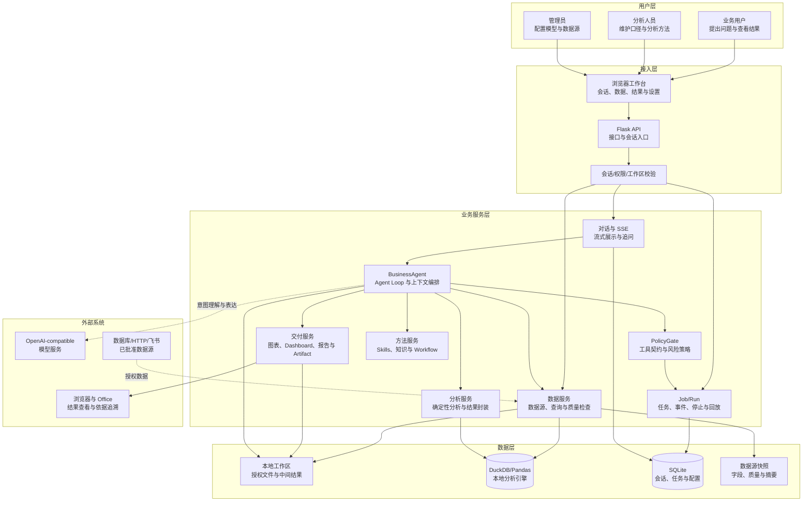

#### 7.1.2 核心使用流程图

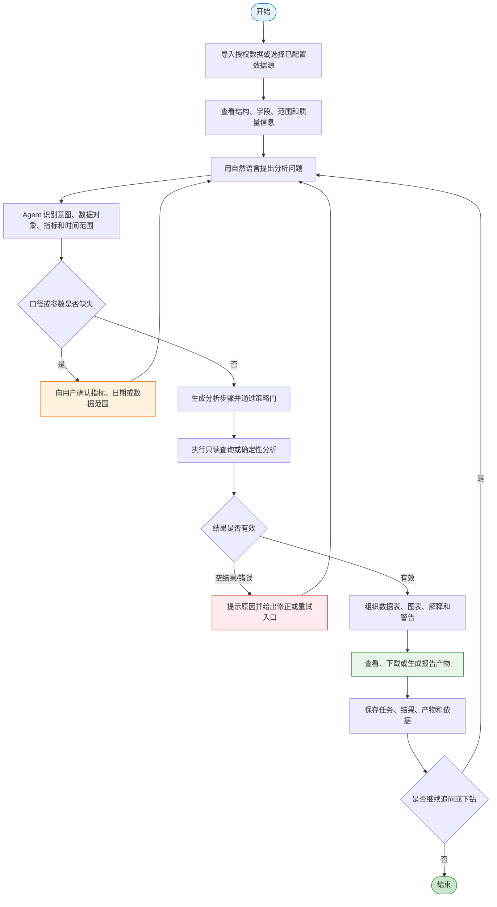

#### 7.1.3 核心数据模型

工具型产品采用轻量数据模型，重点描述分析任务、数据来源和结果产物之间的关联。

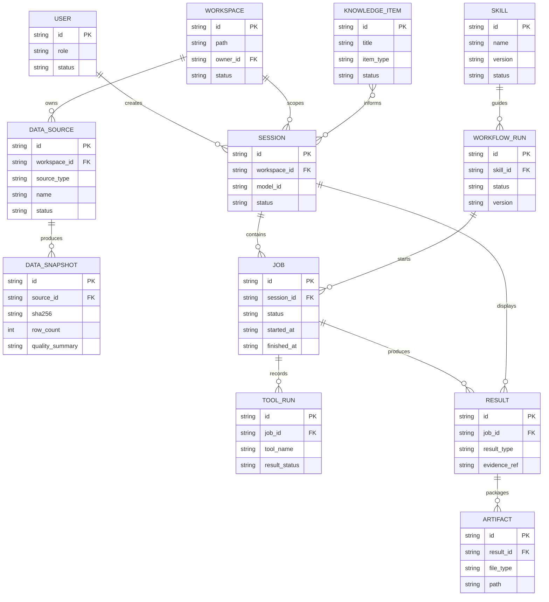

| 核心实体 | 主要职责 | 关键约束 |
| --- | --- | --- |
| Workspace | 组织数据、缓存、中间结果和产物 | 路径必须处于允许范围，禁止访问敏感目录 |
| DataSource | 描述文件、数据库、HTTP 或飞书数据源 | 需要记录类型、名称、状态和连接边界 |
| DataSnapshot | 固化数据结构、摘要和质量信息 | 关键结果应能关联数据快照或来源摘要 |
| Session | 保存用户问题、上下文和结果展示 | 会话之间默认隔离工作区和历史结果 |
| Job/Run | 记录任务执行、节点、状态和事件 | 支持运行、等待确认、成功、失败和取消 |
| Result | 保存结构化查询或分析结果 | 需要区分计算事实、解释和业务推断 |
| Artifact | 保存图表、数据文件和报告 | 产物应关联结果、任务和会话 |
| Skill/Knowledge/Workflow | 沉淀方法、语境和标准流程 | 版本、启用状态和适用范围需要可识别 |

#### 7.1.4 任务状态机

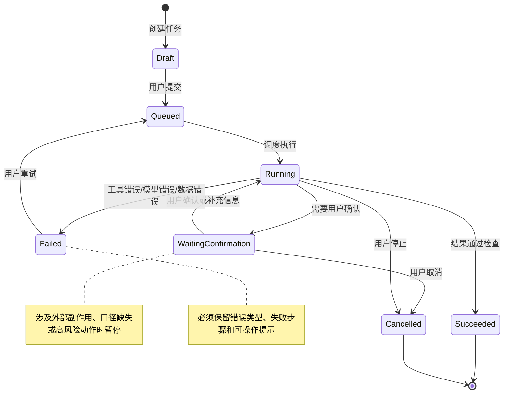

| 当前状态 | 触发事件 | 目标状态 | 备注 |
| --- | --- | --- | --- |
| Draft | 提交任务 | Queued | 问题和必要上下文已具备 |
| Queued | 任务开始执行 | Running | 记录开始时间和任务标识 |
| Running | 需要补充口径或用户确认 | WaitingConfirmation | 前端展示等待原因，不伪造空结果 |
| Running | 结果通过检查 | Succeeded | 保存结果、产物和依据关联 |
| Running | 工具、模型或数据异常 | Failed | 展示错误类型、失败步骤和重试入口 |
| Running/WaitingConfirmation | 用户主动停止 | Cancelled | 清理运行状态并保留取消记录 |
| Failed | 用户选择重试 | Queued | 重试必须产生新的运行记录或明确关联 |

#### 7.1.5 功能清单

| 子系统 | 页面或入口 | PC Web | H5 | App | 说明 |
| --- | --- | --- | --- | --- | --- |
| 工作台 | 智能分析工作台 | ✓ | — | — | 主要用户入口 |
| 工作台 | 会话与结果区 | ✓ | — | — | 消息、工具事件、图表和文件 |
| 数据 | 工作区与数据源 | ✓ | — | — | 文件、数据源、字段和质量信息 |
| 查询分析 | 查询与分析入口 | ✓ | — | — | 只读 SQL、聚合和分析函数 |
| 可视化 | 图表与 Dashboard | ✓ | — | — | 结构化结果展示 |
| 交付 | 文件与报告产物 | ✓ | — | — | JSON、CSV、Excel、Word、PPT |
| 任务 | 任务历史与运行详情 | ✓ | — | — | Job/Run、事件、重试、取消和回看 |
| 方法 | Skills 管理 | ✓ | — | — | 发现、选择和状态管理 |
| 方法 | 知识库与分析语境 | ✓ | — | — | 规则、说明、笔记和文档 |
| 方法 | Workflow 基础入口 | ✓ | — | — | 节点、运行、产物和用户确认 |
| 系统 | 模型、数据源与扩展设置 | ✓ | — | — | 外部能力按配置启用 |

### 7.2 产品功能说明

#### 7.2.1 智能分析工作台与会话

##### 7.2.1.1 使用流程

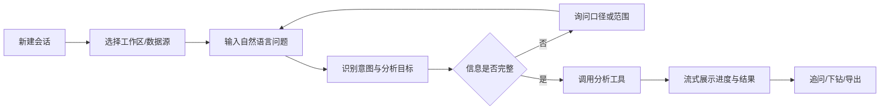

##### 7.2.1.2 使用界面

**页面：智能分析工作台**

| 查询或上下文项 | 默认值 | 字段类型 | 备注 |
| --- | --- | --- | --- |
| 当前工作区 | 最近使用工作区 | 下拉/选择器 | 只展示当前用户可访问范围 |
| 数据源 | 当前会话已选数据源 | 多选/选择器 | 显示数据源类型和状态 |
| 模型 | 当前配置模型 | 下拉 | 真实供应商可用性取决于配置 |
| Skill | 未选择或匹配的 Skill | 选择器 | 可由用户主动指定 |
| 问题输入 | 空 | 多行文本 | 支持业务语言、指标、时间和输出要求 |

| 页面元素 | 展示内容 | 开放修改 | 必输项 | 备注 |
| --- | --- | --- | --- | --- |
| 消息区 | 用户问题、Agent 回答、工具事件、警告 | 否 | — | 支持流式更新 |
| 分析上下文 | 数据源、时间范围、指标、过滤条件 | 是 | 否 | 允许用户纠正上下文 |
| 结果区 | 表格、图表、结论、依据和产物 | 否 | — | 结果应可继续追问 |
| 任务状态 | 排队、运行、等待确认、成功、失败、取消 | 否 | — | 与 Job/Run 关联 |

| 操作按钮 | 操作说明 | 触发条件 |
| --- | --- | --- |
| 新建会话 | 创建新的分析上下文 | 用户需要开始新的任务 |
| 发送问题 | 提交自然语言问题 | 已选择工作区或数据源 |
| 停止任务 | 终止当前运行 | 任务处于运行状态 |
| 补充信息 | 回答 Agent 的澄清问题 | 任务处于等待确认 |
| 继续追问 | 基于当前结果发起下钻 | 已有可用结果 |
| 查看依据 | 展示来源、查询、结果和产物关联 | 结果包含留痕信息 |
| 导出结果 | 下载数据或报告文件 | 已生成可交付产物 |

##### 7.2.1.3 功能规则

| 编号 | 规则类型 | 规则描述 |
| --- | --- | --- |
| R-WB-01 | 事实 | 每次分析必须属于一个会话，并关联当前工作区或已选数据源。 |
| R-WB-02 | 约束 | 没有明确数据对象、时间范围或指标口径时，Agent 应优先询问或提示，而不是直接生成确定性结论。 |
| R-WB-03 | 触发条件 | 当任务进入运行、等待确认、成功、失败或取消状态时，前端应同步展示对应状态和可执行操作。 |
| R-WB-04 | 推论 | 用户明确提出比较、筛选、聚合、下钻或质量检查时，优先选择结构化查询或确定性分析工具。 |
| R-WB-05 | 计算 | 用户可见的数值结论必须来自工具返回的结构化结果，模型只能负责组织解释和表达。 |

##### AI 功能设计

| 分析维度 | 评估 |
| --- | --- |
| 确定性 | 问题理解阶段中等；明确指标查询阶段高；开放式原因研判阶段较低 |
| 容错性 | 文字表达容错性较高；数字、口径和外部副作用容错性较低 |
| 推荐交互模式 | Chat + CUI 嵌入 GUI + Copilot；高风险动作采用用户确认 |

- **人机边界**：Agent 负责问题理解、步骤组织、工具选择和结果表达；系统负责受控执行和状态记录；使用人员负责补充口径、结合业务信息判断归因并确认关键结论。
- **降级方案**：模型不可用时，用户仍可使用数据源预览、只读 SQL、确定性分析和文件导出等非生成式路径；工具不可用时应明确提示，不用模型补写结果。
- **质量保障**：对日期、数据源、字段、空结果、查询错误和工具结果做结构化校验；在回答中区分计算事实、模型解释和业务推断。
- **监控指标**：问题提交成功率、首轮有效结果率、用户纠正率、追问完成率、任务取消率、结果导出率和错误重试率。

#### 7.2.2 工作区与数据接入

##### 7.2.2.1 使用流程

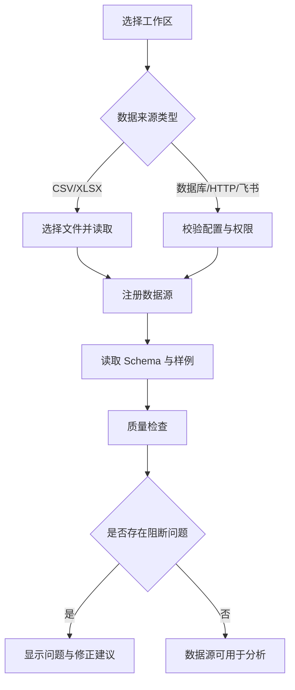

##### 7.2.2.2 使用界面

**页面：工作区与数据源**

| 查询条件 | 默认值 | 字段类型 | 备注 |
| --- | --- | --- | --- |
| 工作区 | 当前工作区 | 选择器 | 展示名称、路径和状态 |
| 数据源类型 | 全部 | 下拉 | CSV、Excel、SQL、HTTP、飞书等 |
| 数据源状态 | 全部 | 下拉 | 已注册、可用、异常、未验证 |
| 关键词 | 空 | 文本 | 匹配数据源名称或表名 |

| 列表字段 | 字段类型 | 开放修改 | 备注 |
| --- | --- | --- | --- |
| 数据源名称 | 文本 | 否 | 需在工作区内唯一或可解析 |
| 数据源类型 | 枚举 | 否 | 记录具体连接器类型 |
| 表/工作表数量 | 数字 | 否 | Excel 多表按当前实现展示 |
| 行数与字段数 | 数字 | 否 | 来源于预览或快照 |
| 质量摘要 | 标签/文本 | 否 | 缺失、重复、日期和空数据提示 |
| 最后更新时间 | 时间 | 否 | 用于判断数据是否需要重新读取 |
| 状态 | 枚举 | 否 | 可用、异常、待配置或待验证 |

| 操作按钮 | 操作说明 | 触发条件 |
| --- | --- | --- |
| 导入文件 | 将授权 CSV/XLSX 加入工作区 | 选择合法文件 |
| 新增数据源 | 配置数据库、HTTP 或其他连接器 | 提供必要配置 |
| 预览数据 | 查看 Schema、样例和质量信息 | 数据源可读取 |
| 刷新数据源 | 重新读取来源数据 | 来源仍可访问 |
| 移除数据源 | 从当前工作区解除注册 | 用户确认且无运行任务依赖 |
| 查看路径 | 展示工作区内相对位置 | 当前用户有访问权限 |

##### 7.2.2.3 功能规则

| 编号 | 规则类型 | 规则描述 |
| --- | --- | --- |
| R-DS-01 | 事实 | 数据源统一记录类型、名称、状态、工作区归属和可用性。 |
| R-DS-02 | 约束 | 文件和挂载路径必须经过规范化并位于允许的工作区范围内，禁止访问 `.env`、`.ssh`、`.git`、密钥、证书和系统敏感目录。 |
| R-DS-03 | 触发条件 | 数据源注册或刷新后，应重新生成字段、行数、日期范围和质量摘要。 |
| R-DS-04 | 推论 | 当数据源存在空数据、关键字段缺失、日期范围异常或重复问题时，分析结果应带有质量警告。 |
| R-DS-05 | 计算 | 数据质量摘要至少包含行数、字段数、缺失记录数、重复记录数和可识别的日期范围。 |
| R-DS-06 | 约束 | 邮件和共享目录当前作为用户获取授权资料的来源，自动读取邮件内容不作为默认数据接入能力。 |

#### 7.2.3 查询与确定性分析

##### 7.2.3.1 使用流程

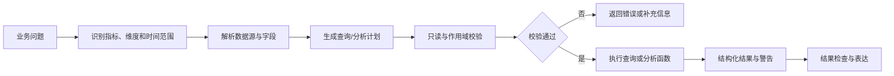

##### 7.2.3.2 使用界面

**页面：查询与分析**

| 查询条件 | 默认值 | 字段类型 | 备注 |
| --- | --- | --- | --- |
| 数据源/表 | 当前会话数据源 | 选择器 | 不允许隐式跨源覆盖 |
| 日期范围 | 用户问题中的明确范围 | 日期范围 | 无法识别时要求确认 |
| 指标 | 用户问题中的指标 | 选择器/文本 | 需关联字段或指标规则 |
| 分组维度 | 用户问题中的维度 | 多选 | 区域、产品、客户、渠道等 |
| 分析类型 | 查询/聚合/趋势/分类等 | 下拉 | 由用户或 Agent 选择 |
| 查询文本 | 空或生成草稿 | 多行文本 | 支持具备权限的用户查看和调整 |

| 列表字段 | 字段类型 | 开放修改 | 备注 |
| --- | --- | --- | --- |
| 查询或分析名称 | 文本 | 否 | 自动生成或由用户命名 |
| 数据源 | 文本 | 否 | 展示来源标识 |
| 关键字段 | 标签 | 否 | 指标、维度和时间字段 |
| 结果行数 | 数字 | 否 | 便于判断结果规模 |
| 警告 | 标签/文本 | 否 | 空结果、类型、口径或样本警告 |
| 执行耗时 | 数字 | 否 | 用于效率跟踪 |
| 状态 | 枚举 | 否 | 成功、失败、取消或待确认 |

| 操作按钮 | 操作说明 | 触发条件 |
| --- | --- | --- |
| 生成查询 | 根据问题组织 SQL 或分析步骤 | 数据源和问题已确定 |
| 检查查询 | 检查只读、范围和字段 | 已有查询草稿 |
| 执行分析 | 运行受控查询或分析函数 | 检查通过 |
| 查看原始结果 | 查看工具返回结构 | 任务完成 |
| 保存为模板 | 将查询或步骤沉淀为复用内容 | 结果通过检查 |
| 重试 | 重新发起失败运行 | 失败状态且数据未失效 |

##### 7.2.3.3 功能规则

| 编号 | 规则类型 | 规则描述 |
| --- | --- | --- |
| R-AN-01 | 事实 | 查询结果应记录数据源、表、字段、条件、执行时间、结果摘要和任务关联。 |
| R-AN-02 | 约束 | 默认只允许只读查询；写入、删除、外部调用或其他副作用动作必须经过专门工具契约和用户确认。 |
| R-AN-03 | 约束 | 查询执行前必须校验数据源存在、字段可用、作用域合法和日期范围可解释。 |
| R-AN-04 | 触发条件 | 出现字段不存在、类型不匹配、空结果、超范围或执行超时时，应停止继续生成确定性结论并返回可操作提示。 |
| R-AN-05 | 推论 | 当问题要求稳定数字、分组、排序、趋势或下钻时，应优先使用查询和确定性分析，而非仅由模型直接回答。 |
| R-AN-06 | 计算 | 关键聚合使用确定性计算方式，结果表达应保留必要的小数、单位、过滤条件和口径说明。 |

##### AI 功能设计

| 任务 | 确定性 | 容错性 | 交互模式 | 主要保障 |
| --- | --- | --- | --- | --- |
| 问题分类与步骤组织 | 中 | 中高 | Chat/Copilot | 展示识别到的指标、维度和时间范围 |
| 只读聚合与对比 | 高 | 低 | CUI 嵌入 GUI | SQL 门禁、字段校验、结构化结果 |
| 开放式原因研判 | 中低 | 中 | Chat + 用户确认 | 明确区分计算事实和业务推断 |
| 预测或高级分析入口 | 依分析类型而定 | 低至中 | Copilot + 结果说明 | 样本量、模型方法、警告和适用范围说明 |

#### 7.2.4 图表、Dashboard 与结果交付

##### 7.2.4.1 使用流程

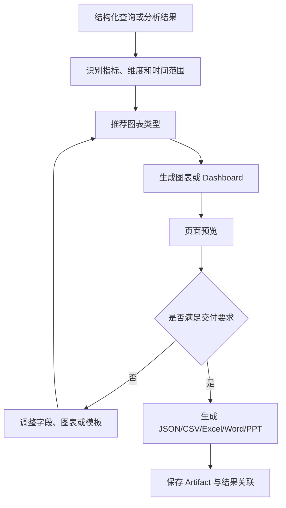

##### 7.2.4.2 使用界面

**页面：结果与产物**

| 查询条件 | 默认值 | 字段类型 | 备注 |
| --- | --- | --- | --- |
| 结果类型 | 全部 | 下拉 | 表格、图表、Dashboard、文件 |
| 产物格式 | 页面预览 | 下拉 | JSON、CSV、Excel、Word、PPT |
| 时间范围 | 继承查询结果 | 日期范围 | 不改变原始分析口径 |
| 产物状态 | 全部 | 下拉 | 生成中、可用、失败 |

| 列表字段 | 字段类型 | 开放修改 | 备注 |
| --- | --- | --- | --- |
| 产物名称 | 文本 | 是 | 支持用户重命名 |
| 结果类型 | 枚举 | 否 | 图表、表格或报告 |
| 数据来源 | 文本 | 否 | 关联数据源或快照 |
| 生成时间 | 时间 | 否 | 与任务运行时间关联 |
| 说明与警告 | 文本 | 否 | 展示口径和质量提示 |
| 文件大小 | 数字 | 否 | 文件型产物展示 |

| 操作按钮 | 操作说明 | 触发条件 |
| --- | --- | --- |
| 预览图表 | 在工作台查看图表和表格 | 结果可视化成功 |
| 生成 Dashboard | 组合多个图表和指标 | 已有可展示结果 |
| 导出文件 | 生成指定格式产物 | 结果结构完整 |
| 下载 | 下载已有 Artifact | 产物可用 |
| 查看依据 | 打开来源、查询和结果关联 | 产物存在关联 |
| 删除产物 | 移除不再需要的文件 | 无运行任务依赖且用户确认 |

##### 7.2.4.3 功能规则

| 编号 | 规则类型 | 规则描述 |
| --- | --- | --- |
| R-OUT-01 | 事实 | 图表和文件产物必须关联一个结构化结果、任务或会话。 |
| R-OUT-02 | 约束 | 图表必须明确指标、分组维度、时间范围和数据来源；缺少关键字段时不能生成误导性图表。 |
| R-OUT-03 | 触发条件 | 结果为空、样本量不足或质量检查未通过时，产物页面应展示警告并允许用户选择继续或修正。 |
| R-OUT-04 | 推论 | 比较类问题优先推荐柱状图或条形图，趋势类问题优先推荐折线图，分布和关系问题按数据类型选择对应图表。 |
| R-OUT-05 | 计算 | 产物中的指标数值必须与结构化结果一致，不因格式转换、四舍五入或排版改变业务口径。 |
| R-OUT-06 | 约束 | Word/PPT/Excel 的可读性、字体、分页、图表和中文显示需要在目标 Office 环境单独检查。 |

#### 7.2.5 会话、任务与历史结果

##### 7.2.5.1 使用流程

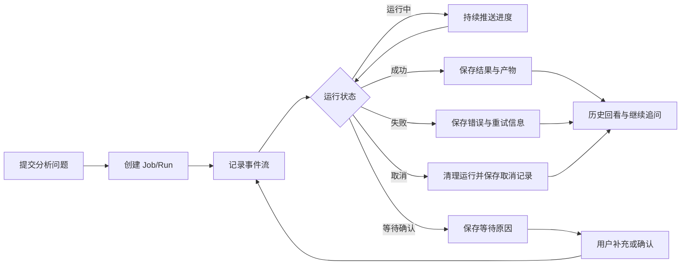

##### 7.2.5.2 使用界面

**页面：任务历史与运行详情**

| 查询条件 | 默认值 | 字段类型 | 备注 |
| --- | --- | --- | --- |
| 时间范围 | 最近 30 天或当前会话 | 日期范围 | 可按会话和工作区筛选 |
| 任务状态 | 全部 | 下拉 | 排队、运行、等待确认、成功、失败、取消 |
| 任务类型 | 全部 | 下拉 | 查询、分析、图表、报告、Workflow |
| 关键词 | 空 | 文本 | 匹配问题、任务名或产物名 |

| 列表字段 | 字段类型 | 开放修改 | 备注 |
| --- | --- | --- | --- |
| 任务名称 | 文本 | 是 | 可由用户修改显示名 |
| 发起时间 | 时间 | 否 | 记录提交时间 |
| 数据源 | 文本 | 否 | 展示主要来源 |
| 当前状态 | 枚举 | 否 | 与状态机一致 |
| 运行耗时 | 数字 | 否 | 完成或取消后展示 |
| 结果与产物数量 | 数字 | 否 | 便于快速回看 |
| 最后错误 | 文本 | 否 | 仅失败任务展示 |

| 操作按钮 | 操作说明 | 触发条件 |
| --- | --- | --- |
| 查看详情 | 打开任务事件、工具调用和结果 | 用户有任务访问权 |
| 继续分析 | 以任务结果作为新上下文 | 任务有可用结果 |
| 重试 | 新建关联运行 | 任务失败且数据仍可用 |
| 取消 | 停止当前运行 | 任务处于运行或等待状态 |
| 下载产物 | 下载任务关联文件 | 产物可用 |
| 删除历史 | 删除用户不再需要的记录 | 满足保留策略且确认 |

##### 7.2.5.3 功能规则

| 编号 | 规则类型 | 规则描述 |
| --- | --- | --- |
| R-JOB-01 | 事实 | 每次任务必须有唯一任务标识、会话标识、状态、开始时间和结束时间或取消时间。 |
| R-JOB-02 | 约束 | 任务事件按顺序写入，前端不能以单条消息替代任务真实状态。 |
| R-JOB-03 | 触发条件 | 用户点击停止后，任务应进入取消或终止清理流程，并保留停止原因和已完成步骤。 |
| R-JOB-04 | 推论 | 失败任务应优先展示失败步骤、错误类型和修正建议，而不是只显示“执行失败”。 |
| R-JOB-05 | 计算 | 任务耗时 = 结束时间或取消时间 − 开始时间；等待用户确认的时间应单独记录。 |
| R-JOB-06 | 约束 | 会话、工作区和结果默认隔离，跨会话恢复必须通过明确的结果 ID 或授权关系完成。 |

#### 7.2.6 Skills、知识与标准化工作流

##### 7.2.6.1 使用流程

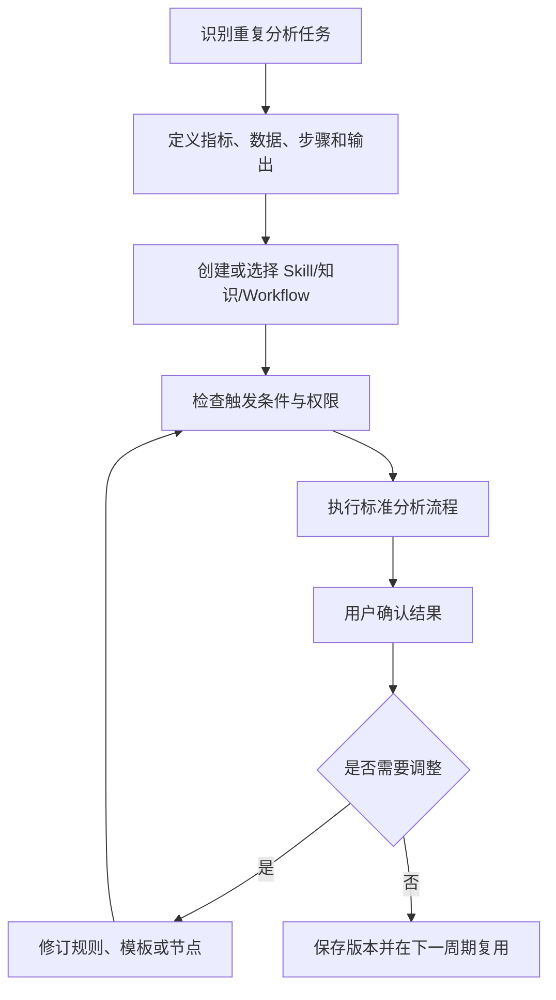

##### 7.2.6.2 使用界面

**页面：方法与能力管理**

| 查询条件 | 默认值 | 字段类型 | 备注 |
| --- | --- | --- | --- |
| 能力类型 | 全部 | 下拉 | Skill、知识、Workflow、Command |
| 状态 | 已启用 | 下拉 | 草稿、启用、停用、实验性 |
| 适用场景 | 全部 | 标签/下拉 | 数据分析、质量、周报、专题等 |
| 关键词 | 空 | 文本 | 匹配名称、说明和标签 |

| 列表字段 | 字段类型 | 开放修改 | 备注 |
| --- | --- | --- | --- |
| 名称 | 文本 | 是 | 需清晰表达业务用途 |
| 类型 | 枚举 | 否 | Skill、知识或 Workflow |
| 版本 | 文本 | 是 | 修改后应可识别 |
| 触发条件 | 文本 | 是 | 说明何时使用 |
| 输出要求 | 文本 | 是 | 说明结果字段、图表或文件 |
| 状态 | 枚举 | 是 | 草稿、启用、停用、实验性 |
| 最近使用 | 时间/次数 | 否 | 支持复用评估 |

| 操作按钮 | 操作说明 | 触发条件 |
| --- | --- | --- |
| 新建能力 | 创建 Skill、知识或 Workflow | 具备编辑权限 |
| 查看版本 | 对比当前与历史版本 | 已有版本记录 |
| 启用/停用 | 改变可用状态 | 通过基本检查 |
| 试运行 | 使用样例数据执行 | 配置完整 |
| 发布到工作区 | 让指定用户或会话可使用 | 权限和范围明确 |
| 归档 | 停止继续使用但保留记录 | 无运行依赖或已确认 |

##### 7.2.6.3 功能规则

| 编号 | 规则类型 | 规则描述 |
| --- | --- | --- |
| R-METHOD-01 | 事实 | Skill 描述触发条件、输入数据、分析步骤、工具要求、输出结构和用户确认点。 |
| R-METHOD-02 | 约束 | 知识内容只能补充业务语境，不能覆盖当前数据、查询结果和用户确认的事实。 |
| R-METHOD-03 | 触发条件 | Skill 或 Workflow 启用前，应完成格式、权限、数据依赖和样例运行检查。 |
| R-METHOD-04 | 推论 | 同一类任务重复出现且步骤稳定时，优先沉淀为 Skill、模板或 Workflow。 |
| R-METHOD-05 | 计算 | 能力复用率 = 被成功复用的任务数 ÷ 使用该能力的任务数，按任务而非消息次数统计。 |
| R-METHOD-06 | 约束 | 规则、知识和流程版本变化后，应保留版本标识，避免历史结果与当前规则混淆。 |

#### 7.2.7 模型、连接与扩展设置

##### 7.2.7.1 使用流程

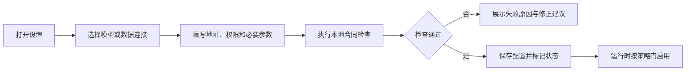

##### 7.2.7.2 使用界面

**页面：系统设置与扩展**

| 配置项 | 默认值 | 字段类型 | 备注 |
| --- | --- | --- | --- |
| 模型名称 | 当前模型 | 下拉 | 具体可用模型取决于供应商配置 |
| API 地址 | 已配置值或空 | 文本 | 不在普通页面明文展示敏感凭据 |
| 工作区路径 | 当前工作区 | 路径选择器 | 需经过允许列表校验 |
| 数据源连接 | 未配置 | 表单 | 按连接器类型显示字段 |
| 外部扩展开关 | 按能力区分 | 开关 | MCP、Hooks、Teams、飞书入口默认可用；云端登录和 GPU/远程执行默认关闭 |
| 日志与结果保留 | 项目默认值 | 选择器 | 需符合组织安全要求 |

| 操作按钮 | 操作说明 | 触发条件 |
| --- | --- | --- |
| 保存配置 | 保存非敏感配置和状态 | 参数格式正确 |
| 测试连接 | 验证目标地址、权限和返回格式 | 已填写必要配置 |
| 启用扩展 | 开启可选能力入口 | 本地合同检查通过 |
| 关闭扩展 | 停止使用可选能力 | 无运行任务依赖或确认 |
| 查看状态 | 查看启用、未验证、休眠或异常状态 | 用户有设置访问权 |

##### 7.2.7.3 功能规则

| 编号 | 规则类型 | 规则描述 |
| --- | --- | --- |
| R-CONF-01 | 事实 | 模型、数据源、工作区和外部扩展均具有独立配置状态和验证结果。 |
| R-CONF-02 | 约束 | 凭据、密钥、证书和浏览器授权状态不得写入项目文档、普通日志或分析结果。 |
| R-CONF-03 | 触发条件 | 外部能力只有在目标地址、凭据、权限、网络和返回格式检查通过后，才允许进入运行路径。 |
| R-CONF-04 | 推论 | 配置入口存在不代表真实服务已经完成连接验证，用户界面应区分可配置、已验证、待验证和默认休眠。 |
| R-CONF-05 | 计算 | 连接可用性以地址可达、认证成功、返回格式正确和最小业务请求成功共同判断。 |
| R-CONF-06 | 约束 | 本地/远程 GPU 执行、云端登录和真实协作服务默认不自动开启，不因模型分析任务自行改变。 |

### 7.3 异常情况处理方案

| 异常类型 | 异常场景 | 处理方案 | 用户可见信息 |
| --- | --- | --- | --- |
| 网络异常 | 模型、HTTP 数据源或外部连接超时 | 记录超时阶段，按策略重试；失败后保留任务状态和重试入口 | 目标服务、阶段、重试次数和下一步建议 |
| 模型异常 | 模型不可用、返回格式错误或超出上下文 | 使用已配置回退模型或非生成式分析路径；不能补写数据结果 | 模型状态、回退路径和未完成步骤 |
| 数据格式异常 | CSV/XLSX 编码、列类型、工作表或文件损坏 | 导入前校验，定位文件和字段，允许用户替换或重新导入 | 文件、字段、错误原因和修正方式 |
| 数据质量异常 | 空数据、缺失值、重复值、日期范围异常 | 生成质量提示，阻断或标记受影响分析，允许用户确认继续 | 质量问题、影响范围和确认入口 |
| 查询异常 | 表名、字段、类型、只读或作用域检查失败 | 不执行不合规查询，返回可解释错误和修正建议 | 查询阶段、字段/范围问题和建议 |
| 分析异常 | 样本不足、算法不适用或结果不稳定 | 返回方法限制、样本信息和警告，不输出确定性业务结论 | 分析方法、样本量、警告和替代路径 |
| 空结果 | 查询执行成功但没有记录 | 保留空结果状态，提示过滤条件、日期范围和数据源检查 | 空结果原因和可调整条件 |
| 任务取消 | 用户停止长任务或关闭页面 | 终止可终止步骤，清理运行状态，保存已完成事件 | 取消时间、已完成步骤和是否可回看 |
| 文件交付异常 | 图表或 Word/PPT/Excel 生成失败 | 保留原始结构化结果，支持重新生成其他格式 | 失败格式、原因和替代下载方式 |
| 权限异常 | 访问未授权工作区、数据源或敏感路径 | 策略门拦截并记录，不暴露敏感路径内容 | 访问被拒绝、所需权限和申请方式 |
| 并发或状态冲突 | 同一任务被重复操作或页面状态过期 | 以服务端任务状态为准，提示刷新或回看最新状态 | 当前状态、冲突动作和刷新入口 |

---

## 8、能力矩阵与产品发展方向

### 8.1 现行能力矩阵

| 能力域 | 现行能力 | 典型功能 | 适用范围 | 能力定位 |
| --- | --- | --- | --- | --- |
| 自然语言分析 | 使用业务语言提出问题，由 Agent 组织分析步骤并返回结果 | 指标比较、趋势分析、异常发现、维度下钻、结果追问 | 适合结构清晰、目标明确的业务问题 | 核心能力 |
| 数据接入与理解 | 统一接入文件、本地数据库和受控外部数据源 | CSV、XLSX、多工作表、SQLite、PostgreSQL、HTTP、飞书多维表格入口 | 以授权数据和中小规模数据为主 | 核心能力 |
| 数据质量检查 | 在分析前查看数据结构和质量信息 | 字段、类型、行数、缺失值、重复值、日期范围、样例记录 | 适合分析前的快速检查和问题定位 | 核心能力 |
| 查询与计算 | 通过受控 SQL 和确定性分析完成稳定计算 | 筛选、排序、分组、聚合、对比、趋势和派生结果 | 适合需要明确数字和可复算过程的问题 | 核心能力 |
| 专业分析 | 提供多类统计和机器学习分析入口 | 聚类、分类、回归、决策树、分箱以及 ARIMA、SARIMA、VAR、Prophet、GRU 等方向 | 结果适用性取决于数据质量、样本量和具体业务场景 | 场景能力 |
| 图表与 Dashboard | 将结构化结果转换为可阅读的图表和看板 | 比较、趋势、分布、关系和分析结果可视化 | 适合分析结果解释和管理展示 | 核心能力 |
| 报告与文件交付 | 输出多种可下载、可回看的分析产物 | JSON、CSV、Excel、Word、PPT、Dashboard 和数据表格 | 文件格式和复杂模板效果取决于目标环境 | 核心能力 |
| 任务与历史回看 | 保存会话、任务、事件、结果和产物 | 任务状态、停止、重试、历史查看、结果继续追问 | 适合周期性分析和问题交接 | 核心能力 |
| 业务方法沉淀 | 将固定分析经验转化为可复用内容 | Skills、知识、查询模板、报告结构和 Workflow | 适合重复性高、步骤相对稳定的部门任务 | 扩展能力 |
| 本地运行 | 在本地工作区完成数据处理和结果组织 | 本地文件、DuckDB、Pandas、SQLite 和工作区产物管理 | 适合办公电脑和授权数据环境 | 核心能力 |
| 外部协同接入 | 保留外部工具和协作服务接入能力 | MCP、Hooks、Teams、飞书机器人、云端登录、GPU | MCP/Hooks/Teams/飞书入口可用但真实服务待配置；云端登录和 GPU/远程执行默认关闭 | 可选扩展 |
| 组织级平台能力 | 可向多用户、服务器和大规模数据方向扩展 | 统一身份、组织隔离、生产数据库、调度、远程算力和高并发 | 不属于本地工作台的默认使用形态 | 发展方向 |

### 8.2 产品能力边界

PFS 的核心定位是“面向企业数据分析工作的本地智能工作台”，主要承担数据理解、查询计算、分析解释、图表生成和结果交付。产品边界可以概括为：

| 适合使用 PFS 的场景 | 不属于默认定位的场景 |
| --- | --- |
| 中小规模 CSV、Excel 或本地数据库分析 | 海量明细数据、复杂实时计算和高并发查询 |
| 日常指标监测、趋势比较和异常发现 | 替代企业数据仓库、统一主数据平台或核心 BI 平台 |
| 需要继续下钻和解释原因的业务问题 | 未经配置直接访问生产数据库、邮箱或外部系统 |
| 需要图表、周报、专题材料和数据文件交付的任务 | 无人工判断的自动经营决策或自动对外发送 |
| 需要保留任务、结果和来源关系的分析工作 | 不依赖任何模型服务的完全离线智能问答 |
| 通过 Skill、知识和 Workflow 复用固定分析方法 | 面向所有企业场景的通用办公自动化平台 |

数据在本地工作区处理，不等于所有模型推理都天然在本地完成。当前模型接入采用 OpenAI-compatible API 形态，实际数据流向取决于部署配置、模型服务和调用方式；使用方应根据数据等级选择合适的模型和部署策略。

### 8.3 与通用 Agent 和传统 BI 的对比

| 对比维度 | PFS 数据分析 Agent | 通用 Agent / 通用办公助手 | 传统 BI 与固定报表 |
| --- | --- | --- | --- |
| 产品定位 | 面向企业数据分析的专用工作台 | 覆盖办公、写作、研究、开发和多类任务的综合入口 | 面向固定指标、看板和周期性报表 |
| 使用入口 | 自然语言 + 数据工作区 + 分析工具 | 自然语言 + 多类工具和连接器 | 看板、筛选器、固定报表和导出 |
| 主要解决的问题 | “为什么变了、哪里变了、如何继续下钻并交付” | “如何完成一个跨场景的综合任务” | “当前指标是多少、趋势如何” |
| 数据处理方式 | 先理解数据结构，再调用受控查询和分析能力 | 依赖用户组织数据、上下文和工具 | 依赖预先建模、指标口径和报表配置 |
| 计算方式 | 模型负责理解和编排，确定性工具负责关键计算 | 计算深度取决于模型、插件和用户提示 | 指标计算稳定，探索范围取决于预设模型 |
| 业务适配 | 可通过 Skills、知识、模板和 Workflow 沉淀部门方法 | 以通用能力和生态连接为主 | 以统一指标、权限和固定展示为主 |
| 分析深度 | 支持比较、下钻、归因线索、质量检查和结果解释 | 能力广，但需要额外组织专业分析流程 | 稳定展示强，临时问题和开放式下钻较有限 |
| 结果交付 | 结论、表格、图表、Dashboard、数据文件和报告 | 文字、文件和任务结果等多种形态 | 看板、固定图表和报表导出 |
| 过程追踪 | 关联数据源、查询、任务、结果和产物 | 取决于具体平台和配置 | 重点是指标和报表版本，不一定保留探索过程 |
| 运行方式 | 本地工作区优先，可按条件扩展 | 通常更依赖通用平台和生态配置 | 通常依赖企业数据仓库和 BI 服务 |

### 8.4 PFS 的核心优势

1. **专业化**：围绕结构化数据、经营数据、专题数据和指标问题设计完整分析链路，重点解决数据理解、异动分析和原因下钻。
2. **低门槛**：以自然语言作为主要入口，业务人员无需先掌握 SQL、Python 或复杂提示词即可启动分析。
3. **高效率**：把读取、整理、筛选、计算、制图和材料组织串联起来，减少在多个文件和工具之间反复切换。
4. **可解释**：模型负责理解与表达，查询和确定性分析负责关键计算，结果能够展示来源、条件、警告和依据。
5. **可追溯**：会话、任务、工具调用、结果和交付产物形成关联，方便历史回看、问题定位和工作交接。
6. **可沉淀**：部门指标口径、异常阈值、分析顺序、报告结构和操作经验可以转化为 Skills、知识和 Workflow。
7. **易协同**：与传统 BI、数据仓库和通用办公助手形成分工，既支持临时分析，也能承接标准化交付。
8. **可扩展**：数据源、分析函数、图表、报告格式、模型和外部工具均有明确扩展入口，能够逐步扩展到更多业务场景。

### 8.5 后续扩展与功能方向

| 优先级 | 扩展方向 | 可增加的功能 | 预期价值 |
| --- | --- | --- | --- |
| P1 | 业务语义层 | 指标目录、业务术语映射、指标口径版本、维度层级和指标关系管理 | 减少字段理解偏差，提升跨人员分析一致性 |
| P1 | 智能监测 | 定时读取数据、指标阈值、异常提醒、趋势预警、异常分组和变化原因线索 | 从用户主动提问扩展到主动发现问题 |
| P1 | 原因分析 | 驱动因素排序、贡献度拆解、原因树、区域/产品/客户多层下钻 | 缩短从异常发现到原因定位的路径 |
| P1 | 分析模板 | 销售分析、经营分析、客户分析、渠道分析、数据质量和周期性报告模板 | 将高频工作沉淀为可复用的部门能力 |
| P1 | 报告中心 | 部门模板、自动排版、版本对比、报告目录和多格式统一交付 | 提高周报、月报和专题材料的交付效率 |
| P1 | 数据连接 | 邮件资料整理、共享目录同步、更多生产数据库、企业 HTTP 服务和协作平台接入 | 减少数据准备环节，扩大可用数据范围 |
| P2 | 结果协同 | 飞书、Teams、邮件等渠道的定时发送、链接分享、评论和结果订阅 | 让分析结果更快进入业务协作流程 |
| P2 | 智能质量控制 | 字段变化检测、口径冲突提示、异常数据隔离、结果质量评分和数据问题清单 | 降低错误数据进入报告的概率 |
| P2 | AI 可靠性增强 | 领域样例评测、用户反馈闭环、回答质量评分、置信度说明和模型自动降级 | 提升复杂任务中的稳定性和可控性 |
| P2 | 多用户工作台 | 企业身份接入、部门工作区、数据范围隔离、共享模板和统一运行记录 | 支撑从个人工具向部门平台演进 |
| P3 | 平台化运行 | 服务器部署、任务调度、独立任务执行、远程 GPU、海量数据处理和高并发 | 支撑更大规模数据和更复杂的组织使用方式 |
| P3 | 多模态分析 | 图片、截图、扫描件和复杂版式文件的识别与结构化分析 | 扩展非结构化业务资料的分析范围 |

### 8.6 产品演进路径

PFS 可以沿着以下路径逐步演进：

演进过程中，产品核心价值保持不变：让数据分析问题更容易表达，让分析过程更容易执行，让结果更容易解释和复用。能力扩展应优先围绕真实业务场景和高频任务展开，不以增加功能数量替代实际使用价值。

### 8.7 正式版本与交付信息

| 交付项 | 当前状态 |
| --- | --- |
| 正式版本 | PFS v0.1.0 |
| 发布提交 | `e10f4b3f7e700ebde721905ded1b674a4c5c636e` |
| 支持平台 | Windows x64、macOS Apple Silicon |
| Windows 安装包 | `PFSDataAnalysisAgent-Windows-x64.exe` |
| macOS 安装包 | `PFSDataAnalysisAgent-macOS-arm64.dmg` |
| 完整性校验 | Release 同时提供 `SHA256SUMS.txt` |
| 自动化质量状态 | 同一发布提交的前端质量、Windows/macOS 测试、安装包构建及 Windows 干净源码安装均已通过 |
| Office 验收 | 既定 Excel、Word、PPT 验收集已完成视觉检查 |
| 发布地址 | <https://github.com/Lukanytsu7551/PFS-data-analysis-agent/releases/tag/v0.1.0> |
| 分发说明 | 当前安装包未进行 Windows 代码签名或 macOS 公证，首次运行可能需要系统确认 |

正式版本已经具备独立安装、核心数据分析、结果交付和历史回看的产品基础。后续应用重点不再是证明“是否存在功能”，而是结合授权业务数据、目标电脑和部门分析流程，持续评估实际效率、结果质量与方法复用价值。
