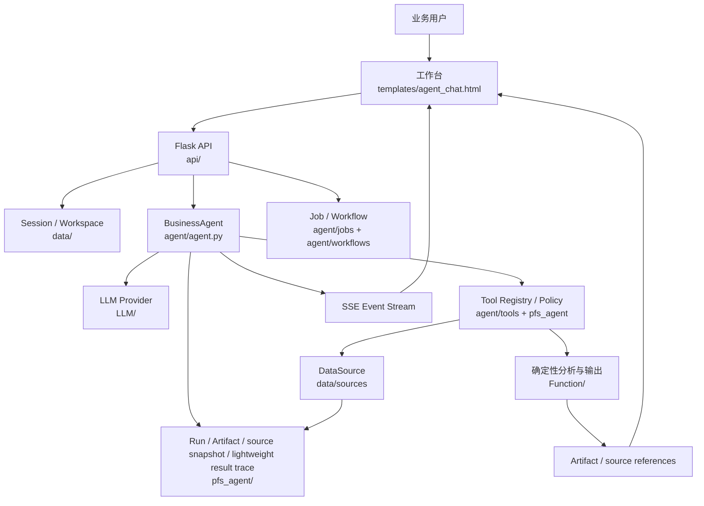
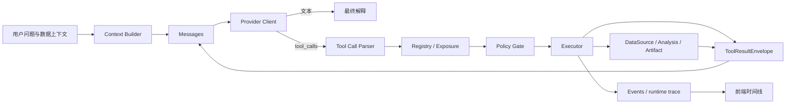
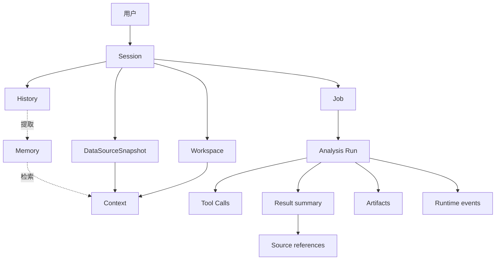

# PFS 数据分析 Agent 项目技术文档

### 1.1 文档目的

本文档用于统一说明 PFS 数据分析 Agent 的业务定位、系统组成、核心运行机制、数据分析链路、交付物管理、配置方式、部署运行边界以及后续扩展规范。文档中的扩展方案用于说明技术演进方向，不代表每一项扩展已经完成或已经过真实外部验收。

本文档关注的是可运行的产品能力和系统合同，包括：

- 用户如何提交问题、数据文件和分析要求；
- Agent 如何理解任务并选择受控工具；
- 数据源如何被加载、描述、冻结和查询；
- 数值计算如何与自然语言解释分离；
- 图表、Excel、Word、PPT 和 Dashboard 等结果如何生成并追踪；
- 会话、任务、运行记录、轻量来源留痕和 Artifact 如何关联；
- 系统在本地如何启动、停止、诊断和复现；
- 新增数据源、工具、模型 Provider 和交付能力时应遵循的边界。

### 1.2 事实来源和状态分层

项目相关信息按以下优先级解释：

1. 当前实际源码和真实运行结果；
2. `docs/HANDOFF.md` 中的现役交接信息；
3. `docs/FUNCTION_COMPATIBILITY_MATRIX.md` 中的逐项能力证据；
4. `docs/PFS_FULL_TRANSFORMATION_PLAN.md` 中的目标和阶段边界；
5. 其他项目说明、历史记录和设计预览。

技术文档中使用以下状态词，避免把计划、源码和线上结果混为一谈：

| 状态 | 含义 |
|---|---|
| 设计目标 | 计划中希望提供的能力，不代表当前已经实现 |
| 源码存在 | 仓库中存在对应实现或接口 |
| 本地可用 | 在当前本地运行环境中可以按规定入口使用 |
| 固定数据可用 | 已通过固定夹具或示例数据确认链路可运行 |
| 外部服务可用 | 需要真实 Provider、真实账号或真实远程服务，且已在当前环境验证 |
| 已提交 | 变更已经形成 Git commit |
| 已推送 | commit 已推送到远程仓库 |
| CI 已通过 | 指定提交已经完成约定的跨平台自动化检查，且全部必需任务通过 |
| 已发布 | 指定提交已经形成版本标签、发布页和可下载产物 |
| 已部署 | 目标部署环境已完成发布 |
| 已上线 | 目标 live 地址已通过实际请求确认 |

除非明确说明，本文档中的“支持”默认指项目具备对应的本地代码路径，不自动等同于外部服务、生产部署或 live 状态已经完成。

### 1.3 当前交付快照

| 事实面 | 当前状态与证据 |
|---|---|
| 源码与远端 | Git 提交与 `origin/main` 均指向发布后的公开元数据清理提交 `932b8a797125eaad86ac9dc1a1c2cce0b361f2b6`；工作树另有未提交的默认开关和文档同步；运行包与 CI 基线为 `e10f4b3f7e700ebde721905ded1b674a4c5c636e` |
| 跨平台 CI | Actions run `34329380624` 对发布提交运行 Windows x64 与 macOS Apple Silicon 回归测试并通过；前端质量、Windows 干净源码安装和双平台安装包构建也通过 |
| 正式发布 | GitHub Release `v0.1.0` 已发布，目标提交为上述 SHA |
| 发布产物 | `PFSDataAnalysisAgent-Windows-x64.exe`、`PFSDataAnalysisAgent-macOS-arm64.dmg` 和 `SHA256SUMS.txt` |
| Office 验收 | 既定 Excel、Word、PPT 验收集已完成视觉检查并确认无问题 |
| 现场设备验证 | 用户已确认 SQL 兼容修复后的 Windows x64 与 macOS Apple Silicon 安装、启动和核心 smoke 通过；不以 Docker 或 CI runner 替代该证据 |
| 真实业务验证 | 用户已确认真实业务验收通过；原始业务文件和内部结论不进入公开仓库 |
| 外部能力 | Provider、生产数据库、飞书、MCP、Hooks、Teams 和外部服务仍按具体账号、权限、网络和配置单独验证；云端登录与 GPU/远程执行默认关闭 |
| 图片分析 | 当前版本不接收用户图片，不提供图片识别或多模态分析能力 |

Release 地址：<https://github.com/Lukanytsu7551/PFS-data-analysis-agent/releases/tag/v0.1.0>

### 1.4 核心术语

| 术语 | 定义 |
|---|---|
| Agent | 能够理解任务、选择工具、执行动作并根据结果继续决策的运行时系统 |
| BusinessAgent | PFS 默认聊天运行时中的核心 Agent 类，负责模型循环和工具调用 |
| Tool | Agent 可以调用的受控程序能力，例如读取数据、执行查询、生成图表或导出文件 |
| DataSource | 对 CSV、XLSX、SQL、HTTP 或其他数据入口的统一抽象 |
| Snapshot | 某次分析开始时固定的数据源视图，保证运行期间引用的数据边界稳定 |
| Session | 用户和工作台之间的持续交互上下文，包含历史消息、数据源和运行状态 |
| Job | 可取消、可追踪的任务执行单元，适合长耗时分析或异步工作流 |
| Run | 一次可追踪的 Agent 或分析执行实例，包含输入、工具调用、结果和状态 |
| Artifact | 系统生成并交付给用户的文件、图表、Dashboard 或结构化结果 |
| Claim | 分析结论中可以被核验的声明，例如“华东区域环比下降 12.4%” |
| Evidence | 支撑 Claim 的数据、查询、计算过程、图表或人工确认记录 |
| Lineage | 从输入数据到查询、计算、结论和 Artifact 的来源链路 |
| Metric Contract | 指标名称、口径、时间范围、过滤条件、聚合方式和单位组成的指标合同 |
| ToolResultEnvelope | 工具返回给 Agent Runtime 的统一结果包装结构 |
| Provider | 提供 OpenAI-compatible Chat Completions 或 Tool Calling 能力的模型服务 |

## 2. 项目概述与业务边界

### 2.1 项目定位

PFS 是面向企业数据分析工作的本地智能 Agent。系统将自然语言交互、结构化数据文件接入、确定性数据处理、模型解释以及可下载交付物组合在一个桌面端工作台中，目标是降低数据分析门槛，并缩短从“提出问题”到“得到可核验结论”的时间。当前版本不包含用户图片分析。

准确的系统定义如下：

> PFS 以 OpenAI-compatible LLM 作为任务理解和决策层，以受控 Tool Calling 作为执行协议，以 DataSource 和确定性分析函数作为事实来源，以 Session、Job 和 Run 管理运行状态，以 Artifact、来源摘要和运行事件保留结果上下文，并通过 Flask/SSE 工作台向用户提供实时分析过程与结果。

### 2.2 业务问题

传统数据分析通常存在以下问题：

- 数据文件分散在 Excel、CSV、业务系统导出文件和在线表格中，业务人员需要先手工整理数据；
- 同一个指标在不同数据表或数据源中可能使用不同时间范围、过滤条件和汇总口径；
- 业务人员需要在 SQL、Python、透视表和图表工具之间切换；
- 结论生成后缺少原始数据、计算过程和交付文件之间的关联；
- 复杂任务容易被拆成多轮沟通，过程和中间结果难以复用；
- 单纯让大模型直接“看表并报数字”存在计算不稳定、口径不透明和无法追溯的问题。

PFS 的解决方式不是让模型直接替代数据计算，而是将模型放在“理解问题、规划动作、解释结果”的位置，将数据读取、过滤、聚合、统计和导出放在可控的程序工具中。

### 2.3 目标用户

| 用户角色 | 主要诉求 | PFS 提供的能力 |
|---|---|---|
| 业务分析人员 | 快速回答经营问题并形成图表 | 自然语言问数、指标比较、趋势分析和可视化 |
| 业务负责人 | 快速查看异常、变化和重点区域 | 结论摘要、变化解释、可下载报告和 Dashboard |
| 数据运营人员 | 处理重复性的分析任务 | 文件上传、数据源复用、SQL/分析工具和 Artifact 历史 |
| 项目开发人员 | 扩展数据源和分析能力 | DataSource、Tool、Provider、Workflow 和结果合同 |
| 管理人员 | 查看重点结论、来源和数据范围 | 结果摘要、来源标识、运行事件和交付物信息 |

### 2.4 典型输入

系统可以处理以下类型的输入，具体可用性以当前配置和 Provider 能力为准：

- 自然语言问题，例如“比较本月和上月各地区销售额，找出下降最多的地区”；
- CSV、XLSX 等结构化数据文件；
- 已注册或已连接的数据源；
- 对输出形式的要求，例如“画柱状图”“导出 Excel”“生成经营摘要”；
- 多轮上下文，例如用户先上传数据，再追问某个地区或某项指标。

### 2.5 典型输出

PFS 的输出分为四类：

1. 自然语言结论：说明结果、变化、范围、口径和必要的限制；
2. 结构化分析结果：表格、指标、排序、分组、趋势和异常记录；
3. 可视化结果：图表 HTML、Dashboard 页面或可嵌入的图表数据；
4. 可下载交付物：JSON、CSV、Excel、Word、PPT 或其他受支持的文件。

输出不只保存“最终一句话”，还应尽可能保留数据快照、查询、计算、图表和文件之间的关系，以支持后续复核。

### 2.6 非目标和当前边界

以下内容不属于当前默认交付边界：

- 手机端或移动端适配不是当前完成条件；
- 根目录 `index.html` 是静态设计预览，不是生产工作台入口；
- 当前系统不是通用自主编程 Agent，也不承诺任意代码执行；
- 当前系统不能笼统宣称具备完整向量数据库 RAG，知识库能力需要按实际配置和接口确认；
- 当前版本不提供用户图片上传、图片识别、图片历史引用或多模态分析；`api/proxy-image` 只服务于外部结果图片的安全展示；
- 本地源码存在不代表 Docker、真实模型、远程服务、部署环境或 live 地址已经验证；
- 模型生成的解释不能替代财务、合规或经营决策中的人工责任。

### 2.7 业务价值衡量

项目价值建议从业务结果衡量，而不是从代码数量衡量：

| 价值方向 | 可观察结果 |
|---|---|
| 降低分析门槛 | 业务人员可以使用自然语言完成原本需要 SQL 或脚本的基础分析 |
| 提升分析效率 | 从上传数据到得到首个有效结论的时间缩短 |
| 提高口径一致性 | 指标合同、时间范围和过滤条件在结果中明确展示 |
| 提升结果可信度 | 结论可以关联来源摘要、查询、快照和生成的交付物 |
| 提高复用性 | Session、Workspace、Artifact 和 Workflow 支持后续追问或重复使用 |

## 3. 技术栈与系统总体架构

### 3.1 技术栈

| 层次 | 技术或模块 | 主要职责 |
|---|---|---|
| 服务入口 | Python、Flask、Waitress | 应用启动、页面服务、HTTP API 和本地监听 |
| 前端 | Vanilla JavaScript、Vite、CSS | 工作台交互、SSE 消费、消息时间线和结果展示 |
| 模型接入 | OpenAI-compatible Provider | 文本对话、Tool Calling 和流式返回；当前版本不接收用户图片 |
| Agent Runtime | `agent/agent.py` 及配套模块 | Prompt 构造、模型循环、工具调用、停止和取消 |
| 工具系统 | `agent/tools/` | Schema、注册、暴露、参数校验、执行和结果封装 |
| 数据访问 | `data/sources/`、DuckDB、SQLAlchemy | 文件读取、Schema 探测、查询、多源合并和数据预览 |
| 分析函数 | `Function/`、业务分析工具 | 清洗、统计、指标计算、图表和 Office 输出 |
| 状态管理 | Session、Workspace、Jobs Store、Workflow Store | 会话、任务、文件和生成物关联 |
| PFS 分析合同 | `pfs_agent/`、`infrastructure/` | Policy、Run、Artifact、确定性结果和轻量来源留痕 |
| 运行目录 | `data/`、`outputs/`、`logs/` 等 | 用户数据、临时文件、生成物和运行日志 |

### 3.2 分层架构



### 3.3 系统中的三条主线

PFS 的完整行为由三条相互关联但职责不同的主线组成：

#### 3.3.1 控制流

控制流描述“谁决定下一步动作”：用户提交请求后，API 负责创建或恢复运行，Agent Runtime 将问题交给模型，模型通过文本或 Tool Call 表达下一步意图，Runtime 决定是否执行工具、是否继续循环以及何时结束。

#### 3.3.2 数据流

数据流描述“事实从哪里来”：文件或外部数据源进入 DataSource，经过 Schema 探测、快照固定、查询和确定性计算，形成表格、指标、图表数据和导出文件，最后作为模型解释的事实输入。

#### 3.3.3 结果留痕流

结果留痕流描述“结果如何被理解和回看”：每次运行记录输入、数据范围、工具调用、计算结果和 Artifact；结果摘要保留必要的来源标识、查询或参数摘要；运行事件记录工具开始、结束、错误、取消和最终状态。当前版本没有独立的 Evidence Ledger、审批状态机或完整治理工作流。

三条主线的关系如下：

```text
控制流：用户 → Agent → Tool → Agent → 终态
数据流：文件/数据源 → Snapshot → 查询/计算 → 结果/Artifact
结果留痕流：Run → 来源/结果摘要 → Artifact/运行事件
```

### 3.4 Agent 内部结构



## 4. 工程结构与代码地图

### 4.1 顶层目录

```text
项目根目录/
├── app.py                         应用启动与服务监听
├── start.command                  macOS 正式启动入口
├── start.bat                      Windows 启动入口
├── api/                           HTTP API、SSE 和页面后端入口
├── agent/                         Agent Runtime、工具、能力和工作流
├── LLM/                           Provider、模型配置和客户端适配
├── data/                          Session、Workspace、数据源和持久化
├── Function/                      数据处理、分析、图表和 Office 输出
├── pfs_agent/                     PFS 工具合同、策略、分析结果和来源结构
├── infrastructure/               启动要求、路径、清理和基础设施
├── frontend/                      Vite 前端源代码
├── templates/                     Flask 模板，真实工作台位于此处
├── static/                        构建产物、CSS 和静态资源
├── docs/                          交接、架构、能力矩阵和项目技术文档
├── outputs/                       生成的用户交付物，运行时目录
├── logs/                          运行日志，运行时目录
```

### 4.2 目录职责

#### `app.py` 和启动脚本

`app.py` 负责创建应用、检查运行条件并启动本地服务。`start.command` 是 macOS 用户的正式入口，负责使用项目虚拟环境启动 `app.py`。启动脚本是产品运行方式的一部分，不应把直接运行某个内部 Python 模块当作普通用户入口。

#### `api/`

`api/` 负责将 HTTP 请求转换为领域动作。核心模块包括：

| 模块 | 职责 |
|---|---|
| `api/__init__.py` | Flask 应用工厂、Blueprint 注册和全局初始化 |
| `api/chat.py` | 聊天请求、Agent 构建、SSE 流和运行结束处理 |
| `api/datasource.py` | 数据源上传、注册、预览和查询相关接口 |
| `api/jobs.py` | 长任务查询、取消和状态接口 |
| `api/models.py` | Provider 和模型配置接口 |
| `api/workspace.py` | 工作区文件、元数据和 Artifact 关联 |
| `api/pfs.py` | PFS 分析运行、结果和来源投影接口 |
| `api/lifecycle.py` | 应用生命周期和本地运行状态接口 |

API 层不应直接实现复杂的数据分析逻辑。它负责身份、输入、权限、生命周期和协议转换，具体执行交给 Agent、Tool、DataSource 或结果记录模块。

#### `agent/`

`agent/` 是模型驱动的决策和执行层：

| 模块 | 职责 |
|---|---|
| `agent/agent.py` | `BusinessAgent` 主循环、消息处理和停止判断 |
| `agent/prompts.py` | 系统 Prompt、工具说明和动态上下文组装 |
| `agent/instructions.py` | 业务规则、输出约束和运行指令 |
| `agent/compaction.py` | 上下文压缩和历史裁剪 |
| `agent/retry.py` | Provider 调用和可重试错误处理 |
| `agent/events.py` | 运行过程事件定义和分发 |
| `agent/jobs.py` | 长任务运行、取消和进度管理 |
| `agent/tools/` | 工具合同、注册、执行和结果 |
| `agent/skills/` | Skill 的发现、解析、注册和执行 |
| `agent/commands/` | Slash Command 的解析、目录和分发 |
| `agent/workflows/` | 可持久化工作流的模型、服务和调度 |
| `agent/teams/` | 多成员或委派式任务的计划与协调 |

#### `data/`

`data/` 保存会话、工作区、数据源和持久化状态。它是“数据和状态的来源层”，不负责决定 Agent 应该回答什么。

关键对象包括：

- `ChatSession`：保存对话历史、当前数据源、取消状态和工具审计；
- `DataSourceSnapshot`：固定本次分析可以引用的数据视图；
- `Workspace`：管理上传文件、生成文件和会话关联；
- `JobsStore`：持久化长任务状态、进度、错误和取消信息；
- `data/sources/base.py` 中的 `DataSource`：统一不同数据入口的操作接口。

#### `pfs_agent/`

`pfs_agent/` 是 PFS 业务合同、策略和确定性分析结构，不是普通模型 Prompt 的别名。该目录负责定义：

- 哪些工具可以执行、需要哪些参数和权限；
- 一次分析如何开始、运行、结束和失败；
- 生成的 Artifact 如何登记和追踪；
- 分析结果如何携带来源和参数摘要；
- 数据快照、查询、计算和结果如何形成轻量来源关系；
- 哪些信息应进入运行事件，以及如何支持故障定位和结果回看。

#### `frontend/`、`templates/` 和 `static/`

`templates/agent_chat.html` 是当前真实工作台模板，负责承载聊天页面和页面结构。`frontend/features/chat-stream.js` 负责消费 SSE 事件并更新前端状态。根目录 `index.html` 仅作为静态设计预览，不能作为“真实 Agent 已经可用”的证据。

### 4.3 核心代码索引

| 文件 | 关键对象或函数 | 说明 |
|---|---|---|
| `app.py` | `main()`、`ensure_requirements()` | 启动进程并监听端口 |
| `api/__init__.py` | `create_app()` | 创建 Flask 应用 |
| `api/chat.py` | `chat_stream()`、`_build_agent()` | 聊天主入口和 Agent 组装 |
| `agent/agent.py` | `BusinessAgent`、`run()` | 默认聊天 Agent Runtime |
| `agent/tools/schemas.py` | `AGENT_TOOLS` | 提供给模型的 JSON Schema |
| `agent/tools/registry.py` | `ToolSpec`、`ToolRegistry` | 工具注册和元数据 |
| `agent/tools/exposure.py` | 工具暴露和可用性判断 | 控制哪些能力进入当前运行 |
| `agent/tools/results.py` | `ToolResultEnvelope` | 工具结果统一包装 |
| `pfs_agent/policy.py` | `PolicyGate` | 参数、权限、风险和预算门禁 |
| `pfs_agent/runtime.py` | `build_builtin_registry()` | 内置工具与 PFS 合同映射 |
| `data/session.py` | `ChatSession`、`DataSourceSnapshot` | 会话和数据快照 |
| `data/sources/base.py` | `DataSource` | 数据源抽象接口 |
| `agent/jobs.py` | `JobRunner` | 长任务执行和取消 |
| `pfs_agent/reporting.py` | `AnalysisResult`、`DataSnapshot` | 确定性分析、来源快照和轻量结果引用 |
| `infrastructure/artifact_lifecycle.py` | Artifact 生命周期对象 | 交付物登记和状态变化 |
| `frontend/features/chat-stream.js` | SSE 事件处理器 | 前端时间线和结果更新 |

## 5. 启动、进程与运行目录

### 5.1 正式启动入口

macOS 下使用项目根目录中的：

```bash
./start.command
```

该入口会使用项目配置的虚拟环境启动应用，默认监听：

```text
http://127.0.0.1:5001
```

本地开发或需要指定端口时，可以使用：

```bash
PFS_PORT=5012 .venv/bin/python app.py
```

普通用户应优先使用 `start.command`，开发人员在需要并行运行多个实例或定位端口冲突时再使用显式端口方式。

### 5.2 启动链路

```text
./start.command
  → .venv/bin/python app.py
  → 环境和目录检查
  → api.create_app()
  → 注册 Flask Blueprint
  → 初始化 Session、Workspace、数据源和运行时服务
  → Flask/Waitress 开始监听
  → 浏览器访问 templates/agent_chat.html
```

### 5.3 运行目录

运行时产生的文件应与源码、配置和交付文档分离：

| 目录 | 内容 | 管理要求 |
|---|---|---|
| `data/` | Session、Workspace、索引和数据状态 | 不提交用户数据和数据库文件 |
| `outputs/` | Excel、Word、PPT、JSON、CSV 和临时导出物 | 按 Artifact 生命周期管理 |
| `logs/` | 应用日志、运行日志和错误记录 | 避免写入密钥和完整敏感数据 |
| `.venv/` | Python 运行环境 | 不提交 |
| `node_modules/` | 前端依赖 | 不提交 |
| `static/dist/` | 前端构建产物 | 按项目发布策略管理 |

### 5.4 正式关闭

关闭本地 Agent 时，应结束由 `start.command` 启动的实际服务进程，优先使用终端中的 `Ctrl-C`。如果服务在后台运行，应先确认监听端口对应的 PID，再结束该 PID，避免误停其他服务。

推荐检查方式：

```bash
lsof -nP -iTCP:5001 -sTCP:LISTEN
```

如果使用了其他端口，将 `5001` 替换为实际端口。`/api/health` 只能说明 HTTP 服务是否响应，不能单独证明真实模型、数据源和完整分析链路可用。

### 5.5 运行状态判定

一次完整的本地运行判定至少包含四层：

| 层级 | 判定内容 |
|---|---|
| 进程层 | 目标 PID 正在监听预期端口 |
| HTTP 层 | 页面和必要 API 可以返回 |
| Agent 层 | 当前 Provider 可以完成模型调用或明确返回配置错误 |
| 业务层 | 上传或加载数据后可以完成一次真实分析并返回结果或可定位错误 |

不能使用“页面打开了”“健康检查通过”替代业务层判定。

## 6. HTTP、SSE 与前端交互

### 6.1 API 分组

当前 API 按职责大致分为以下几组：

| API 组 | 主要职责 |
|---|---|
| Session/Chat | 创建会话、发送消息、恢复历史和流式聊天 |
| DataSource | 上传文件、注册数据源、Schema、预览、查询和快照 |
| Job | 查看长任务、取消任务、读取进度和结果 |
| Workspace | 文件、工作区元数据和生成物关联 |
| Model | Provider、模型和运行参数配置 |
| Artifact/Output | 获取图表、下载文件和查看交付物历史 |
| PFS | 分析 Run、结果和来源投影 |
| Audit | 查看工具、策略和运行事件 |
| Workflow | 保存、运行、暂停和查看工作流 |
| System/Lifecycle | 健康状态、运行环境和应用生命周期 |

路由的具体前缀和参数以 `api/` 当前实现为准。新增接口时应先确定其归属，不应让前端直接调用内部执行函数。

### 6.2 聊天请求主链

典型请求从浏览器到服务端的流程如下：

```text
用户在工作台输入问题
  → 前端提交 POST /api/session/<sid>/chat
  → 服务端校验 Session 所有权、输入长度、配额和运行状态
  → 读取当前 Workspace 和 DataSource
  → 固定 DataSourceSnapshot
  → 创建 conversation Job / Analysis Run
  → _build_agent() 组装模型、Prompt、Tools 和运行预算
  → BusinessAgent.run() 开始模型循环
  → 事件编码为 SSE
  → 前端逐事件更新消息、工具时间线、图表和下载入口
  → 保存消息、Run、Artifact、来源摘要和运行事件
  → 发送 done 或 error
```

### 6.3 请求边界

API 层至少需要处理以下边界：

- Session 是否存在且属于当前用户或当前本地工作区；
- 请求是否包含有效文本或已选择的数据源；当前聊天接口不接收图片附件；
- 当前运行是否已经取消、过期或达到并发限制；
- 上传文件是否在允许的类型和大小范围内；
- Provider 和模型配置是否完整；
- 请求是否试图访问未暴露的 Tool 或越过权限策略；
- 外部输入是否包含路径穿越、危险查询、未授权资源或超预算行为。

API 层的错误应返回稳定的错误类别和可读信息，不能把 Python 堆栈直接暴露给用户。

### 6.4 SSE 事件合同

聊天流使用 Server-Sent Events 向前端发送过程和结果。事件名称应被视为前后端协议的一部分。

| 事件 | 作用 | 常见字段 |
|---|---|---|
| `conversation_activation` | 会话或上下文进入运行 | 会话、模型或数据上下文 |
| `conversation_step_started` | 一个运行步骤开始 | 步骤名称、阶段信息 |
| `conversation_step_finished` | 一个运行步骤结束 | 状态、耗时和摘要 |
| `tool_start` | 工具开始执行 | `tool_call_id`、工具名、参数摘要 |
| `tool_end` | 工具完成 | 工具名、状态、结果摘要、耗时 |
| `tool_audit` | 工具策略或运行记录 | 决策、原因和摘要 |
| `tool_result_summary` | 工具结果摘要 | 工具标识、摘要和来源 |
| `reasoning` | 可展示的阶段状态信息 | 阶段、摘要、可见性 |
| `text` | 文本内容或增量 | 文本、消息标识 |
| `chart` / `chart_ref` | 图表结果或资源引用 | 图表标识、HTML 或资源引用 |
| `artifact_created` / `file` | 交付物创建或文件引用 | Artifact、文件名和下载信息 |
| `pfs_result` | PFS 分析结果摘要 | 结果、来源和状态 |
| `stopped` | 用户或系统停止运行 | 停止原因和运行状态 |
| `error` | 运行失败或部分失败 | 错误类别、用户信息、可恢复性 |
| `done` | 运行进入终态 | 状态、结果和 Artifact 引用 |

事件合同的基本要求：

1. 每次有效运行应出现会话激活或步骤开始事件，最后有 `done`、`stopped` 或 `error`；
2. 工具事件必须能够通过 `tool_call_id` 与同一次运行关联；
3. 增量文本可以分多次发送，前端不能假设一次事件就是完整句子；
4. 结果较大时应发送引用或摘要，不应无限制地把原始数据塞入流；
5. 运行取消、超时和 Provider 错误应能够被前端区分；
6. 审计事件可以展示为时间线，但不能让审计字段成为模型可篡改的普通文本。

### 6.5 前端消费模型

`frontend/features/chat-stream.js` 将 SSE 事件转换为前端状态。前端不负责重新推断后端业务结果，而是根据事件更新：

- 当前消息的流式文本；
- 正在执行和已经完成的工具卡片；
- 分析阶段、耗时和用量信息；
- 图表 HTML、表格结果和下载按钮；
- 运行成功、取消、超时或失败状态；
- Artifact 和历史记录的关联入口。

前端展示的“正在分析”不等于工具已经执行完成；只有收到对应 `tool_end`、结果事件或 `done` 后，才能将阶段标记为完成。

### 6.6 页面入口区分

| 页面或文件 | 性质 | 是否代表真实运行工作台 |
|---|---|---|
| `templates/agent_chat.html` | Flask 提供的实际聊天工作台 | 是 |
| `frontend/entries/chat-app.js` | 工作台前端入口 | 是 |
| `frontend/features/chat-stream.js` | 流式交互能力 | 是 |
| 根目录 `index.html` | 静态 UI 设计预览 | 否 |

因此，网页视觉完成、静态页面可打开和真实工作台可以接通模型是三个不同状态，汇报或验收时应分别描述。

## 7. Agent 技术架构

### 7.1 Agent 的工程定义

PFS 中的 Agent 不是“给模型发送一句 Prompt 并返回回答”的接口。它是一个由运行状态、模型调用、工具协议、数据上下文、终止条件和审计机制共同组成的循环系统。默认聊天主循环由 `agent/agent.py` 中的 `BusinessAgent.run()` 控制，并不依赖 LangChain Agent Executor 或 LangGraph 作为默认运行时。

一次 Agent 决策只能产生两类有效结果：

1. 产生面向用户的文本内容；
2. 产生一个或多个符合协议的 `tool_calls`，请求程序执行明确动作。

Runtime 在收到工具调用后不会无条件执行。它需要解析参数、确认工具处于暴露范围、通过策略门禁、执行对应 Python 能力、封装结果并重新交给模型。模型根据工具结果决定继续调用工具还是形成最终回答。

### 7.2 `BusinessAgent.run()` 主循环

主循环可以抽象为：

```text
初始化 Run
  → 构造 system + history + user + dynamic context
  → 计算本轮可见工具集合
  → 调用 OpenAI-compatible Provider
  → 接收文本增量或 tool_calls
  → 若只有最终文本：整理结果并结束
  → 若有 tool_calls：逐个解析和校验
  → 执行 Tool，形成 ToolResultEnvelope
  → 将结果以 role=tool 写回 messages
  → 进入下一轮模型调用
  → 达到完成、取消、超时、预算或错误终态
```

对应伪代码如下：

```python
messages = build_messages(system_prompt, history, user_input, context)
visible_tools = tool_registry.exposed_names(...)

for iteration in range(max_iterations):
    ensure_not_cancelled()
    ensure_time_and_cost_budget()

    response = provider.chat(messages=messages, tools=schemas(visible_tools))
    assistant_message = normalize_response(response)
    messages.append(assistant_message)

    if not assistant_message.tool_calls:
        return finalize(assistant_message.content)

    for call in assistant_message.tool_calls:
        arguments = parse_json(call.arguments)
        spec = registry.require(call.name)
        policy_gate.authorize(spec, arguments, runtime_context)
        raw_result = execute_tool(spec, arguments)
        envelope = build_tool_result_envelope(call.name, raw_result)
        emit_tool_events(call, envelope)
        messages.append(as_tool_message(call.id, envelope))

return limited_terminal_state()
```

伪代码只描述合同，不替代当前源码。真实实现还包含并行工具、委派执行、结果持久化、上下文压缩、重试、事件和审计等分支。

### 7.3 模型消息结构

Agent 每轮提交给 Provider 的消息通常包括：

| 消息来源 | 角色 | 内容 |
|---|---|---|
| 系统指令 | `system` | Agent 身份、数据分析规则、工具使用顺序和安全边界 |
| 历史对话 | `user` / `assistant` / `tool` | 当前 Session 中仍在上下文预算内的消息 |
| 动态数据上下文 | 通常并入系统或用户上下文 | 数据源 Schema、Workspace、Skill、Command 和恢复信息 |
| 当前输入 | `user` | 用户问题、数据上下文和输出要求；当前版本无图片附件 |
| 模型决策 | `assistant` | 文本内容或结构化 `tool_calls` |
| 工具反馈 | `tool` | 与 `tool_call_id` 对应的有界结构化结果 |

工具结果必须使用 Provider 支持的 `role=tool` 合同返回。把工具结果拼成普通用户文本会破坏调用关联，也会提高模型将结果误认为新需求的风险。

### 7.4 运行终态

| 终态 | 含义 | 对外表现 |
|---|---|---|
| completed | 模型已给出最终文本，必要交付物已经登记 | SSE `done`，Run 完成 |
| canceled | 用户或系统请求取消 | 停止后续工具，保留可用中间记录 |
| timed_out | 运行超过时间边界 | 返回明确超时类别，不伪装成业务结论 |
| budget_exceeded | 达到 Token、成本、轮次或工具次数边界 | 返回受限终态和已完成范围 |
| provider_error | Provider 无法调用或返回不可恢复错误 | 保留 Provider 错误类别和重试信息 |
| tool_error | 工具执行失败且 Agent 无法恢复 | 记录工具、参数摘要和错误分类 |
| policy_denied | 动作被权限、风险或范围规则拒绝 | 明确拒绝原因，不执行目标动作 |

### 7.5 运行上限

当前核心运行时定义了以下保护性上限：

| 配置 | 当前代码值 | 作用 |
|---|---:|---|
| `MAX_ITERATIONS` | 120 | 普通 Agent 最大循环轮数 |
| `MAX_RUN_SECONDS` | 1800 秒 | 普通运行时间边界 |
| `DELEGATED_MAX_TOOL_ROUNDS` | 50 | 委派 Agent 最大工具轮次 |
| `TEAM_MEMBER_MAX_TOOL_CALLS` | 100 | 单个 Team 成员工具调用上限 |
| `DELEGATED_TIMEOUT_SECONDS` | 300 秒 | 单次委派执行超时 |
| `MAX_DISPLAY_ROWS` | 200 行 | 返回给模型的数据表最大展示行数 |

这些值是运行保护，不是业务性能承诺。修改上限必须同时评估 Provider 上下文、工具成本、用户等待时间、SSE 连接、内存和审计数据量。

### 7.6 取消与恢复

取消信号必须在模型调用前、工具执行前后和长任务检查点被读取。对于已经完成的写入或 Artifact 生成，取消不能被解释为“从未发生”；系统应保留已完成动作的事实并标记运行终态。

恢复机制依赖 Session、Workspace、Job 和持久化结果，而不是依赖模型“记得上一轮”。恢复上下文应包含：

- 上次运行的稳定标识和终态；
- 当前仍有效的数据源和 Snapshot；
- 已生成 Artifact 及其位置；
- 尚未完成或可重试的阶段；
- 已经执行过的写操作，避免重复执行。

## 8. LLM Provider 与模型适配层

### 8.1 Provider 适配目标

PFS 使用 OpenAI-compatible 接口统一不同模型服务。适配层的目标不是假设所有模型完全相同，而是把下列差异集中在 `LLM/` 中处理：

- Base URL、API Key 和模型名称；
- 是否支持 Tool Calling；
- 是否支持图片或多模态输入（能力字段为 Provider 扩展预留，当前聊天入口不接收图片）；
- 是否支持流式返回；
- 上下文窗口和最大输出长度；
- 超时、重试和并发限制；
- Token 用量字段和价格元数据；
- 特定 Provider 的请求或响应兼容处理。

`LLM/llm_config_manager.py` 中的 `LLMConfig` 和 `LLMConfigManager` 负责管理内置 Provider 和自定义模型配置，`get_llm_client()` 等入口负责创建客户端。

### 8.2 配置对象

一个完整的模型配置至少需要描述：

| 字段 | 含义 | 管理原则 |
|---|---|---|
| provider | Provider 稳定标识 | 不能只使用展示名称做关联 |
| model | 实际模型 ID | 以 Provider 当前支持值为准 |
| base_url | API 入口 | 必须校验协议和目标范围 |
| api_key | 认证密钥 | 进入凭据存储，不写入日志和仓库 |
| enabled | 是否可选 | 禁用配置不能进入默认模型列表 |
| context_window | 声明的上下文上限 | 不能覆盖上游真实限制 |
| max_output_tokens | 声明的输出上限 | 应小于等于上游和模型限制 |
| pricing | 输入和输出单价 | 未知时保持未知，不用零伪装 |
| capabilities | Tool、Stream 等能力；Vision 仅为扩展预留 | 用于前端和 Runtime 的能力判断 |

### 8.2.1 当前内置模型目录

当前代码内置以下模型配置。显示在前端的可用性还取决于配置是否启用、对应 API Key、网络和 Provider 当前状态；模型目录存在不等于真实模型调用已经验收。

| Provider 标识 | 展示/用途 | 默认模型或端点 | 密钥环境变量 |
|---|---|---|---|
| `deepseek` | DeepSeek | `deepseek-chat` / `https://api.deepseek.com` | `DEEPSEEK_API_KEY` |
| `kimi` | Kimi | `kimi-k3` / Moonshot OpenAI-compatible API | `MOONSHOT_API_KEY` |
| `kimi_coding` | Kimi Coding Plan | `kimi-k2.7-code` / Moonshot Coding | `KIMI_CODING_API_KEY` |
| `glm` | GLM | `glm-5.2` / 智谱通用 API | `GLM_API_KEY` |
| `glm_coding` | GLM Coding Plan | `glm-5.2` / 智谱 Coding API | `GLM_CODING_API_KEY` |
| `minimax` | MiniMax | `MiniMax-M3` / MiniMax API | `MINIMAX_API_KEY` |
| `minimax_coding` | MiniMax Coding Plan | `MiniMax-M3` / Coding API | `MINIMAX_CODING_API_KEY` |

OpenAI/ChatGPT、AtlasCloud 和 Ollama 不属于当前内置产品目录。旧配置只作为迁移兼容边界，不应重新出现在默认模型选择中。用户仍可以按当前配置合同增加自定义 OpenAI-compatible 模型。

### 8.3 模型选择与运行组装

`api/chat.py` 中的 `_build_agent()` 根据当前 Session、用户选择和配置组装 Agent。组装过程应完成：

1. 解析本轮指定 Provider 或默认 Provider；
2. 读取对应 `LLMConfig`；
3. 创建兼容客户端；
4. 确认模型能力与本轮输入匹配；
5. 应用上下文、输出、超时和成本预算；
6. 注入 Prompt、Tool Registry、Workspace 和 DataSource Snapshot；
7. 将实际模型元数据写入 Run 和用量事件。

当前版本没有用户图片上传路径，因此不会把图片发送给 Provider，也不提供视觉能力协商。若未来重新纳入图片分析，应先同时增加上传、附件存储、历史引用、安全校验和多模态消息合同，再为支持视觉的 Provider 增加能力判断；在此之前不能对外宣称“图片识别可用”。

### 8.4 上下文限制的解释

模型上下文存在多层有效限制：

```text
有效上下文上限
= min(
    项目代码默认值,
    Provider 配置声明值,
    客户端或网关限制,
    上游模型真实限制,
    当前账号或路由策略限制
  )
```

因此，在本地配置中写入较大的 `context_window` 只能改变本地预算计算，不能强制上游模型接受同样长度。收到上游 `context_length_exceeded`、输入 Token 超限或网关拒绝时，应以真实响应为准，并触发裁剪、压缩或模型切换。

### 8.5 重试和降级

适合重试的情况通常包括暂时性网络失败、限流、网关 5xx 和短时不可用。不适合原样重试的情况包括：

- API Key 无效；
- 模型名称不存在；
- 上下文确定超限；
- Tool Schema 不被 Provider 支持；
- 参数格式永久错误；
- 账号没有权限。

重试应采用有界次数和退避策略，并在 Run 中记录重试原因。切换 Provider 属于显式降级行为，必须保留“最终实际使用的模型”，不能只展示用户最初选择的模型。

### 8.6 用量和成本

用量事件应尽可能记录输入 Token、输出 Token、缓存 Token、模型和 Provider。只有在单价和计费口径已知时才能计算成本；价格未知时应标记为 unknown。成本预算由代码和策略执行，不能仅在 Prompt 中要求模型节省用量。

## 9. Prompt、Context 与上下文管理

### 9.1 Prompt 的职责

Prompt 负责告诉模型如何工作，但不替代权限、数据和运行控制。PFS 的 Prompt 应覆盖：

- Agent 的角色和业务范围；
- 数据分析时必须遵循的工具顺序；
- 使用真实 Schema 和字段名的要求；
- 数值必须来自查询或确定性计算的要求；
- 图表和交付物生成规范；
- 口径、时间范围、过滤条件和单位的表达方式；
- 信息不足、空结果和冲突时的处理方式；
- 不得越权访问文件、数据源和外部服务的约束。

Prompt 不能作为安全边界。即使 Prompt 写明“不要执行删除”，Runtime 仍需在 Registry 和 Policy Gate 中强制检查。

### 9.2 单轮上下文组成

一次模型调用的有效上下文不是完整项目文件，而是经过选择和有界化的组合：

```text
基础系统指令
+ 当前 Provider 能力说明
+ 本轮可见 Tool Schema
+ Session 中保留的历史消息
+ 当前用户问题和数据源引用
+ DataSource Snapshot / Schema 摘要
+ Workspace 元数据或相关文件片段
+ 激活的 Skill / Command 指令
+ Knowledge 查询结果
+ Team / Workflow / 恢复上下文
+ 上一轮工具结果
```

每一部分都应有来源、大小和生命周期边界。不能因为模型支持长上下文，就把整个工作区或全部数据直接注入消息。

### 9.3 Context 与 State 的区别

| 对象 | 含义 | 生命周期 |
|---|---|---|
| State | 系统保存的真实状态，例如 Session、Job、Artifact、数据源连接 | 可以跨模型调用或跨进程持久化 |
| Context | 当前一次模型调用可见的信息集合 | 每轮重新组装，受 Token 预算限制 |
| Memory | 从历史中提取并长期保存的用户或业务信息 | 按明确策略读写，不等于全部历史 |
| Knowledge | 通过检索获得的业务定义、文档片段或模板 | 按问题检索，不默认全部注入 |
| Snapshot | 某次运行固定的数据源版本和范围 | 绑定 Run，用于可复现和结果回看 |

模型看不到某项 State 不代表 State 不存在；模型消息里出现一段文本也不代表它已经成为持久化 State。

### 9.4 历史压缩

随着多轮对话和工具结果累积，上下文会快速增长。压缩机制应遵循：

1. 保留当前用户问题和最近必要对话；
2. 保留仍被引用的 Tool Call 与 Tool Result 配对；
3. 将较早的自然语言历史压缩为结构化摘要；
4. 大型工具结果持久化后只注入摘要和引用；
5. 不在压缩中改变已确认的业务口径、时间范围和结果；
6. 对生成文件、写操作和人工确认保留稳定标识；
7. 压缩后仍需满足 Provider 对消息角色和工具调用关联的协议要求。

`agent/compaction.py` 和阶段压缩模块负责相关行为。压缩失败时应安全裁剪或明确报错，不能静默删除决定性结果上下文。

### 9.5 Prompt Injection 边界

上传文件、网页、知识库片段和外部 Tool 结果全部属于不可信内容。它们可能包含“忽略之前指令”“调用某工具”“上传密钥”等文本。系统应：

- 将外部内容作为数据标记，而不是系统指令；
- 只暴露本轮必要工具；
- 在代码中实施权限和参数校验；
- 对 URL、路径、SQL 和写操作执行独立验证；
- 不从文档内容中自动提取并执行命令；
- 对高风险动作要求显式用户意图或确认。

### 9.6 Knowledge 与 RAG 边界

`query_knowledge` 可以检索指标定义、业务规则、SQL 模板和已建立索引的文档片段。只有在对应知识存储、索引和检索链路实际配置时，才能把它描述为可用知识库能力。项目存在知识接口，不等于已经建立了覆盖所有业务文档的向量数据库 RAG。

## 10. Tool 系统与受控执行

### 10.1 Tool 的职责

Tool 是模型与确定性程序之间的边界。模型只表达“要调用哪个工具、传入什么参数”，实际权限判断、执行、资源访问和结果记录由代码完成。一个可用 Tool 至少同时具备：

1. Prompt-facing JSON Schema；
2. Runtime 中的稳定名称和 `ToolSpec`；
3. 对应执行函数；
4. 参数和业务校验；
5. Policy Gate 和权限要求；
6. 统一结果封装；
7. 事件、错误和审计记录；
8. 必要时的 Job 化、取消和 Artifact 登记。

### 10.2 六段执行链

```text
Schema
  → Registry / Exposure
  → Policy Gate
  → Executor
  → ToolResultEnvelope
  → role=tool + Event + lightweight trace
```

#### Schema

`agent/tools/schemas.py` 中的 `AGENT_TOOLS` 使用 OpenAI-compatible Function Tool 格式描述工具名、用途、参数类型和必填字段。Schema 的主要消费者是模型。

#### Registry / Exposure

`agent/tools/registry.py` 中的 `ToolSpec` 描述工具类别、是否默认暴露、发现关键词、数据源要求、并发安全性、执行模式、Workspace 要求以及 Command/Skill 关联。Registry 决定工具是否进入当前模型调用，而不仅是“系统有没有实现这个函数”。

#### Policy Gate

Policy Gate 根据工具类别、用户意图、参数、运行预算、数据范围和权限作出允许、拒绝或要求确认的决策。删除、写入、外部发送和远程执行等动作不能只依赖模型自觉。

#### Executor

Executor 将经过校验的参数传给实际 Python 能力。长任务根据 `execution_mode` 和 `job_threshold` 转入 Job；并发安全的只读工具可以在受控条件下并行，写工具默认不应并行。

#### ToolResultEnvelope

工具执行结果统一包装为：

```json
{
  "type": "tool_result",
  "tool": "query_data",
  "ok": true,
  "error": "",
  "summary": "按地区汇总完成，共 6 行",
  "data": {},
  "sources": [],
  "artifacts": [],
  "debug": {}
}
```

发给模型的内容会去除不必要的调试信息，并使用有界摘要。必要的运行信息可保留在会话、Job、Artifact 和运行事件中；当前版本不承诺独立审计账本。

#### role=tool、Event 与结果留痕

Envelope 通过 `role=tool` 返回给模型，通过 SSE 事件反馈给前端，并以轻量运行记录保留执行事实。这些投影面向不同消费者，不应互相替代。

### 10.3 工具分类

| 类别 | 典型用途 | 风险特征 |
|---|---|---|
| read | Schema、查询、Workspace 元数据、知识检索 | 通常低风险，但仍需数据范围限制 |
| analysis | 统计、画像、图表选择 | 计算密集，需数据质量和规模限制 |
| write | 创建分析表、清洗、更新外部记录 | 可能改变状态，需要更强门禁 |
| output | 导出 Excel、报告、PPT、Dashboard | 产生 Artifact，需要受控路径和生命周期管理 |
| interaction | 向用户确认、选择或补充信息 | 影响运行流程，需要稳定状态保存 |

### 10.4 代表性工具

| 工具 | 作用 | 关键前置条件 |
|---|---|---|
| `workspace_status` | 返回工作区有界元数据 | Runtime 可用 |
| `query_knowledge` | 检索指标定义和业务规则 | 知识存储已配置 |
| `get_schema` | 获取数据表和字段 | 已连接 DataSource |
| `get_table_detail` | 获取单表完整字段和行数 | 表名必须来自 Schema |
| `query_data` | 执行只读 SQL 查询 | SQL 校验、数据源可用 |
| `create_analysis_table` | 创建派生分析表 | 只允许受控派生对象 |
| `delete_analysis_tables` | 删除确认的派生表 | 精确表名和显式确认 |
| `run_analysis` | 运行确定性统计模板 | 合法字段和分析参数 |
| `select_chart` | 根据意图匹配图表类型 | 已知字段和展示目标 |
| `generate_chart` | 生成可视化结果 | 字段映射和数据量受控 |
| `profile_data` | 生成字段分布和质量摘要 | 可能转为 Job |
| `clean_data` | 生成清洗后的派生数据 | 不覆盖原始数据 |
| `export_excel` | 生成 Excel Artifact | 输出路径和来源登记 |
| `export_report` | 生成报告 Artifact | 结论和数据来源明确 |
| `generate_ppt` | 生成 PPT Artifact | 内容结构和资源可用 |
| `generate_dashboard` | 生成 Dashboard Artifact | 数据与图表定义完整 |
| `read_tool_result` | 分页读取已持久化的大结果 | 结果 ID 属于当前范围 |
| `search_mcp_tools` | 发现 MCP 工具 | MCP 服务已连接 |

### 10.5 结果有界化

工具结果不能无限制进入模型上下文。当前结果层对常规结果设置约 2,000 字符的默认预算，并允许对特定工具配置独立预览上限。超出阈值的完整结果应持久化，模型只接收摘要、前若干行和稳定引用；需要继续读取时使用 `read_tool_result` 分页获取。

数据查询同时受 `MAX_DISPLAY_ROWS = 200` 约束。该限制只控制给模型展示的行数，不代表查询底层只能处理 200 行，也不代表导出文件只能包含 200 行。

### 10.6 错误分类

工具错误应被归类，而不是统一返回“执行失败”：

| 错误类别 | 示例 | Runtime 行为 |
|---|---|---|
| argument_error | 必填字段缺失、类型错误 | 允许模型修正参数 |
| sql_validation_error | 非只读 SQL 或危险语句 | 拒绝执行并说明边界 |
| field_not_found | 字段不存在 | 要求重新读取 Schema |
| table_not_found | 表不存在 | 检查表名或数据快照 |
| empty_result | 查询合法但无数据 | 返回空结果范围，不伪造数字 |
| datasource_disconnected | 数据源失效 | 尝试恢复或要求重新连接 |
| permission_error | 资源或账号无权限 | 停止原动作并说明权限要求 |
| mcp_error | MCP 服务或协议错误 | 隔离外部工具失败 |
| chart_generation_error | 图表参数或数据形状不匹配 | 调整图表合同或字段映射 |

### 10.7 并行与 Job 化

仅当工具在 `ToolSpec` 中标记为 `concurrency_safe`，且调用之间没有数据依赖时，Runtime 才应并行执行。创建表、写入文件、修改外部记录和依赖前一工具输出的调用必须串行。

`execution_mode` 支持 `sync`、`auto` 和 `job`。`auto` 工具根据阈值决定同步执行还是进入 Job，例如大规模查询、数据画像或图表生成。Job 化后仍需保留原 Tool Call 与最终结果的关联。

## 11. Skill、Command、MCP 与能力发现

### 11.1 能力机制分层

PFS 同时包含 Skill、Command、MCP、Workflow 和 Teams 等扩展机制。这些机制都可以影响 Agent 的可用能力，但它们解决的问题不同：

| 机制 | 解决的问题 | 典型形态 | 是否等同于 Tool |
|---|---|---|---|
| Skill | 一组面向场景的规则、Prompt、工具组合和执行约束 | 数据分析、飞书多维表格、报告生成 | 否，Skill 通常激活或约束 Tool |
| Command | 用户主动发起的明确操作入口 | `/分析`、`/导出`、`/清理` | 否，Command 是路由和激活机制 |
| MCP | 连接外部工具服务器的协议 | 搜索、网页、外部系统能力 | 否，MCP 提供外部 Tool 来源 |
| Workflow | 可保存、复用和调度的多阶段流程 | 定时经营分析、固定分析任务 | 否，Workflow 编排多个动作 |
| Teams | 多成员或委派式任务协作 | 分别负责数据、分析、报告 | 否，Teams 是协作运行模式 |

### 11.2 Skill 生命周期

一个 Skill 从定义到运行通常经历：

```text
文件或内置定义
  → Loader 读取
  → Parser 解析元数据和指令
  → Registry 注册
  → Availability 判断当前环境是否满足条件
  → Activation 绑定到本轮 Session/Command
  → Prompt 注入规则和工具关联
  → Runtime 按 Skill 约束执行
  → Run/运行事件记录激活和结果
```

Skill 可以说明分析口径和操作顺序，但不能绕过 Tool Registry、Policy Gate 或数据源权限。Skill 文件、知识文档和外部返回内容同样属于不可信输入，加载后必须经过边界控制。

### 11.3 Command 生命周期

Command 的处理链为：

```text
用户输入命令
  → Parser 识别命令名和参数
  → Catalog/Loader 查找定义
  → Availability 判断是否可用
  → Dispatcher 分派到具体处理逻辑
  → 生成 Activation 或直接创建 Job/Workflow
  → 进入统一 Agent/Tool Runtime
```

Command 不应复制一套独立的权限和数据访问逻辑。它应复用现有 Session、Tool 和运行/结果对象，确保命令触发的动作与自然语言触发的动作使用相同的安全门禁。

### 11.4 MCP 能力发现

MCP 工具默认不应全部暴露给每一轮模型调用。`search_mcp_tools` 用于在用户意图匹配时发现外部能力，发现结果需要经过：

- 服务连接状态确认；
- 工具名称和描述校验；
- 当前用户和 Workspace 权限确认；
- 参数 Schema 转换；
- 超时、重试和结果长度限制；
- 外部副作用和数据出境评估。

MCP 服务返回的文档、网页文本和工具结果不能自动提升为系统指令。外部服务的可用性、账号授权和网络状态需要单独记录。

### 11.5 扩展能力默认边界

以下扩展能力不应成为普通数据分析聊天的隐含前置条件。MCP、Hooks、Teams、飞书机器人入口默认可用，但只有在目标、凭证、权限和独立配置齐备后才会执行对应外部动作；云端登录接口保留但默认关闭，GPU 或远程执行总开关也默认关闭：

- Hooks；
- Teams 和委派式执行；
- MCP 外部工具；
- 飞书机器人和外部消息推送；
- 云登录和外部身份系统；
- GPU 或远程执行（默认关闭）；
- 退役的 Business Canvas、Google Sheets。

入口可见或开关可用不等于外部服务已经验收；没有真实目标环境证据时只能记录为“启用未验收”“实验性”或“待配置”。

## 12. Session、State、Memory、Run 与 Job

### 12.1 对象关系



### 12.2 Session

`ChatSession` 是用户交互的容器，负责维护：

- Session 稳定 ID；
- 对话历史；
- 当前连接的数据源和数据上下文；
- Workspace 标识和文件关联；
- 正在运行的任务、取消信号和恢复信息；
- 工具调用审计和历史 Artifact 引用。

Session 不应被当作唯一的审计对象。一个 Session 可以包含多次独立 Run，每次 Run 需要独立的输入范围、模型、工具和终态。

### 12.3 Snapshot

数据分析开始前固定 `DataSourceSnapshot`，用于回答“本次结论基于哪一份数据”。Snapshot 至少应描述：

- 数据源标识和类型；
- 文件或表的稳定标识；
- 快照建立时间；
- 数据版本、文件摘要或连接信息摘要；
- 表名、字段和行数概览；
- 时间范围、过滤条件和数据质量提示。

同一 Run 中的查询和计算应尽量引用同一 Snapshot。若外部数据源在运行中发生变化，应新建 Snapshot 或标记结果不可直接复现。

### 12.4 Job

Job 是可观察、可取消和可恢复的执行单元，适合：

- 大规模数据查询或加载；
- 数据画像、清洗和批量分析；
- 图表或 Office 文件生成；
- Workflow 和委派式执行；
- 需要较长时间的外部调用。

Job 状态建议使用以下状态机：

```text
queued → running → succeeded
                 ├→ failed
                 ├→ canceled
                 └→ timed_out
```

每个状态变更应记录时间、原因和关联 Run。取消是状态转换，不是直接删除 Job。

### 12.5 Run

Run 表示一次完整的 Agent 或 PFS 分析执行。建议至少记录：

| 字段 | 含义 |
|---|---|
| `run_id` | 一次运行的稳定标识 |
| `session_id` | 所属 Session |
| `job_id` | 所属长任务，可为空 |
| `model` / `provider` | 实际使用的模型和服务 |
| `snapshot_id` | 数据快照 |
| `started_at` / `finished_at` | 开始和结束时间 |
| `status` | 运行终态 |
| `tool_calls` | 工具调用摘要 |
| `artifacts` | 生成物引用 |
| `usage` | Token 和成本信息 |
| `error` | 错误类别和用户可读信息 |

Run 不应只在内存中存在。至少应将终态和可复核的关键元数据持久化。

### 12.6 Memory

Memory 用于保存跨轮次或跨 Session 仍有价值的信息，例如用户偏好、经确认的指标口径或常用分析设置。它不应自动保存全部原始对话和敏感数据，也不应覆盖当前数据 Snapshot 的事实。

Memory 的写入应明确来源、更新时间、作用域和置信状态；删除或更正时应有可追踪记录。知识库检索结果属于 Context，不应未经确认直接写入长期 Memory。

## 13. 数据源、Schema 与 SQL 执行

### 13.1 DataSource 抽象

`data/sources/base.py` 定义统一数据源接口，核心操作包括：

| 方法 | 作用 |
|---|---|
| `get_schema()` | 返回表、字段和基础结构信息 |
| `execute_query(sql)` | 执行查询并返回 DataFrame 与错误信息 |
| `get_preview()` | 返回表级元数据和行数概览 |
| `get_preview_table()` | 按需读取某个表的有限行数据 |
| `create_analysis_table()` | 创建受控的派生分析表 |
| `list_tables()` | 列出原始和派生表 |
| `format_result()` | 将结果转换为有界文本 |

前端和 Agent 只依赖该抽象，不应在业务层直接实例化某一种具体数据源。

### 13.2 数据源类型

当前数据层包含以下实现或接入方向：

| 类型 | 实现 | 说明 |
|---|---|---|
| CSV | `CSVDataSource` | 读取本地 CSV 并注册为可查询表 |
| Excel | `ExcelDataSource` | 读取 XLSX 工作表并处理表头、字段和数据类型 |
| SQL | `SQLDataSource` | 连接 SQL 数据库，并按需加载表 |
| HTTP API | `HTTPAPIDataSource` | 拉取 JSON 并转换为分析表 |
| 飞书多维表格 | `FeishuBitableDataSource` | 将已授权记录载入当前分析上下文 |
| 合并数据源 | `MergedDataSource` | 将多个来源组织到统一查询范围 |
| Workspace 持久化 | `WorkspacePersistentDataSource` | 管理工作区中可复用的结构化文件 |

各类数据源的真实可用性取决于文件、连接、凭据、网络和功能开关。

### 13.3 文件接入流程

```text
上传文件
  → 校验扩展名、大小和文件名
  → 保存到受控 Workspace
  → 识别编码、表头和工作表
  → 清理重复或非法字段名
  → 推断数据类型并处理空值
  → 注册 DataSource
  → 生成 Schema 和预览
  → 建立 Snapshot
  → 提供给 Agent 查询和分析
```

上传文件不应直接使用用户原始文件名拼接路径。路径必须在受控 Workspace 内解析，防止路径穿越和任意文件覆盖。

### 13.4 Schema 探测

Schema 是模型生成查询的基础事实。`get_schema` 负责返回表名和字段信息；当数据表超过 20 张时，当前 SQL 数据源只对前 20 张提供完整列信息，其余表通过表清单和 `get_table_detail` 按需展开。

Schema 内容至少应包含：

- 精确表名；
- 精确字段名和数据类型；
- 行数或规模摘要；
- 可用于时间筛选、分组和聚合的字段提示；
- 空值、重复值或类型异常提示；
- 数据源和 Snapshot 标识。

模型写 SQL 前必须读取 Schema 或特定表详情，不能根据用户描述猜测字段名。

### 13.5 SQL 安全边界

数据分析主链路默认只允许只读查询。SQL 执行前至少执行：

1. 语句类型和 AST/词法检查；
2. 是否包含 INSERT、UPDATE、DELETE、DROP、ALTER 等写或破坏性操作；
3. 表和字段是否在当前 DataSource/Snapshot 范围内；
4. 查询是否包含过大的扫描、笛卡尔积或无界输出风险；
5. 路径读取函数是否指向 Workspace 白名单；
6. 返回结果是否需要转入 Job；
7. 是否生成派生表，且派生表名称和生命周期可追踪。

`create_analysis_table` 只用于受控派生数据，原始表不得被覆盖。`delete_analysis_tables` 只允许在用户明确确认精确表名后删除可证明属于分析范围的派生表。

### 13.6 结果范围和大数据处理

底层查询可以处理超过模型展示上限的数据，但模型上下文只接收有界结果。大数据分析应优先采用：

- SQL 聚合后再返回；
- 创建派生分析表；
- 按时间、地区或业务维度分片；
- 统计摘要、分位数和异常样本；
- Job 化处理；
- 持久化完整结果并通过引用读取。

不要将完整明细表直接拼入 Prompt。当前 SQL 数据源的懒加载上限为 `PFS_LAZY_LOAD_LIMIT` 配置值，默认代码值为 500,000，具体仍受内存和底层数据库限制。

## 14. 数据分析、图表与交付物

### 14.1 分析职责分离

PFS 将分析分为三个职责：

| 层级 | 负责内容 |
|---|---|
| 模型层 | 将自然语言问题转为指标、维度、时间范围和分析计划 |
| 确定性分析层 | 执行过滤、聚合、统计、排序、比较和质量计算 |
| 解释层 | 将已计算结果组织为业务结论、限制和建议 |

模型可以提出“比较本月与上月”，但本月销售额和环比百分比必须由查询或分析函数计算。模型不应凭记忆补全缺失数据。

### 14.2 Metric Contract

一个可核验的指标至少应定义：

```text
指标名称
+ 指标含义
+ 数据源和表
+ 指标字段
+ 聚合方式
+ 时间字段
+ 当前时间范围
+ 对比时间范围
+ 过滤条件
+ 分组维度
+ 单位和小数位
+ 空值和异常处理
```

`pfs_agent/reporting.py` 中的 `MetricContract`、`AnalysisRequest`、`DataSnapshot`、`EvidenceRecord` 和 `AnalysisResult` 用于承载上述结构。指标口径不完整时，应先要求澄清或明确标记假设。

### 14.3 内置分析

`run_analysis` 用于调用确定性分析模板，例如分位数、时间序列、分组比较、AB Test、数据画像等。调用前需要：

- 先读取 Schema；
- 确认 `analysis_name` 与当前问题匹配；
- 用真实 SQL 提取必要字段；
- 指定目标字段和可选分组字段；
- 传递分析所需选项；
- 将结果表或结构化结果交给后续图表和解释步骤。

### 14.4 图表流程

```text
明确业务问题和展示对象
  → 读取字段和结果形状
  → select_chart 匹配图表类型
  → 确认 required_roles、data_format 和约束
  → 构造 field_mapping
  → generate_chart
  → 保存图表 HTML/数据 Artifact
  → 将图表和结论关联到 Run/来源摘要
```

用户明确提出图表但模型不确定图表 ID 或字段角色时，必须先调用 `select_chart`，不能猜测 `generate_chart` 参数。图表展示不应掩盖数据缺失、空结果或样本量限制。

### 14.5 Office 和 Dashboard 输出

导出工具负责将已确认的结构化结果转换为业务交付物：

- Excel：明细、汇总、指标口径和必要的来源信息；
- Word：标题、摘要、指标表、图表和结论；
- PPT：适合汇报的页面结构、图表和重点结论；
- Dashboard：指标卡、筛选器、图表和数据来源；
- JSON/CSV：供系统或用户继续处理的结构化结果。

输出工具不应重新计算一套与分析层不一致的数字。所有交付物都应登记 Artifact，并尽可能携带来源 Run、Snapshot、Metric Contract 和来源摘要。

### 14.6 图片分析边界

当前版本不实现用户图片上传和视觉分析，不提供图片附件 API、图片历史引用、多模态消息或 Vision capability negotiation。聊天主链的输入是文本和已连接的数据上下文；XLSX、XLS、CSV 等结构化文件通过数据源上传接口进入工作区。

`api/system.py` 中的 `/api/proxy-image` 只用于安全代理外部结果图片，解决部分图片地址无法由浏览器直接访问的问题；它不是用户上传入口，也不能证明 Agent 具备图片识别能力。若未来重新纳入图片分析，应作为独立功能补齐附件存储、作用域校验、历史清理、视觉模型判断和多模态消息合同后再验收。

## 15. Artifact、来源关系与轻量结果留痕

> 本章中 Ledger、审批、语义复算和治理状态机属于已撤回的历史方案。现役能力只保留来源快照、必要的结果/来源摘要、Artifact、Run/Job 事件和可恢复工具结果。

### 15.1 结果留痕对象

| 对象 | 核心问题 |
|---|---|
| Artifact | 用户最终拿到的是什么 |
| Claim | 结果摘要中表达了什么结论 |
| Evidence | 结论可关联的查询、计算或来源摘要 |
| Lineage | 结果经过了哪些输入和计算 |
| Audit | 系统实际做了哪些工具、策略和状态动作 |
| Ledger | 历史治理方案；当前不维护独立账本 |

### 15.2 结论来源链

一条标准来源链如下：

```text
原始文件/外部表
  → DataSource
  → DataSnapshot
  → Schema
  → SQL 或分析参数
  → 确定性计算结果
  → 结果摘要
  → 自然语言解释 / Chart / Artifact
```

`ToolResultEnvelope` 中的 `sources` 和 `artifacts` 提供运行时投影；当前分析结果可携带来源标识、计算参数、结果摘要、时间和版本信息，不额外维护独立的 Evidence Ledger。

### 15.3 结果摘要的生成和核验

结果结论不应由模型凭空编造。当前运行以查询和确定性计算结果作为事实基础，并保留必要的来源摘要；推荐的结论组织方式是：

1. 从分析结果中提取带数值和口径的候选结论；
2. 记录其来源工具、SQL、Snapshot 和指标合同；
3. 在运行结果中保留必要的计算参数和范围；
4. 将结果摘要、来源和限制写入最终回答或 Artifact 引用；
5. 用户可依据原始数据和交付物核对结果，当前系统不设置专门的结果确认岗位，也不提供审批状态机。

使用结果时应区分三个层次：

| 状态 | 含义 |
|---|---|
| 计算结果 | 查询或程序根据给定数据和口径计算得到的结果 |
| 用户确认 | 使用人员对数据范围、指标口径和关键数字进行确认 |
| 业务判断 | 使用人员结合业务背景对结果作出的解释或决策 |

不能把模型提出的解释直接写成已确认的业务事实或风险结论。

### 15.4 RecomputeContract

本节是关键分析的设计参考，不代表当前版本存在独立的复算服务或发布前质量门。

对于关键分析结论，建议在结果或交付物中保留可解释的计算上下文：

- 指标和维度；
- 当前期、对比期和时区；
- 过滤条件；
- 聚合和排序；
- 原始值、对比值和变化公式；
- 预期精度和舍入方式；
- Snapshot 和数据版本。

例如环比变化应明确：

```text
环比变化率 = (本期值 - 对比期值) / 对比期值 × 100%
```

对比期为零、缺失或不适用时必须返回空值和原因，不能输出无穷大或编造百分比。

### 15.5 Artifact 生命周期

Artifact 至少经历：

```text
created → available → referenced → archived
                    └→ failed
```

生成文件时应记录：

- Artifact 稳定 ID；
- 文件类型和路径；
- 创建时间和创建 Run；
- 输入数据和 Snapshot；
- 文件大小、哈希和状态；
- 访问或下载权限；
- 失败原因或归档原因。

输出路径不能直接由模型控制。文件必须保存在受控输出根目录，下载接口通过稳定 ID 查找，而不是接受任意绝对路径。

### 15.6 运行事件

运行事件用于记录真实运行事实，包括：

- 用户请求和运行标识；
- 工具暴露和策略决策；
- Tool Call 参数摘要；
- 工具开始、结束、耗时和结果状态；
- 取消、重试、超时和 Provider 错误；
- Artifact 创建、下载和归档；
- 结果摘要、来源引用和错误恢复信息。

运行日志应避免保存 API Key、完整敏感文件内容和不必要的原始数据。需要对外部署时，运行日志的访问权限和保留周期仍需独立设计。

## 16. Workflow、Teams 与 Delegated LLM

### 16.1 Workflow

Workflow 用于把可重复的分析流程保存为结构化定义，并支持后续运行、暂停、恢复或调度。一个典型 Workflow 包括：

```text
输入定义
  → 数据源和权限要求
  → 阶段列表
  → 每阶段 Tool/Prompt/输出合同
  → 条件和依赖
  → Artifact 和通知策略
  → 运行状态与历史
```

Workflow 与普通聊天的区别在于：普通聊天由模型根据当前对话临时决定下一步，Workflow 预先定义了可复用的阶段、参数和依赖。Workflow 仍然需要经过同一套 Tool Registry、Policy Gate、Job 和结果留痕机制。

### 16.2 Teams

Teams 用于将复杂任务拆分给多个角色或成员。适合的场景包括数据准备、独立分析、结果复核和报告编排，但并不意味着系统天然具备可靠的多智能体协作。成员之间需要明确：

- 输入和输出 Schema；
- 可调用工具范围；
- 只读或写入权限；
- 最大工具调用次数；
- 超时和取消传播；
- 最终汇总者的责任；
- 冲突结论的处理方式。

### 16.3 Delegated LLM 边界

委派式 LLM 只能在显式创建的执行上下文中运行。它应继承或复制必要的 Session 和 Workspace 作用域、DataSource Snapshot、Tool 暴露、Policy、预算、取消信号以及结果来源关联。委派成员默认不应获得父 Agent 未拥有的权限，也不能通过自然语言绕过父运行的预算和数据范围。

### 16.4 适用性判断

对于单个文件的常规问数、指标比较和图表生成，普通 `BusinessAgent` 主循环已经足够。只有在任务具有稳定角色边界、可并行的独立子任务或长期复用的阶段结构时，才应引入 Teams 或 Workflow。增加协作层会增加状态、失败恢复、成本和结果汇总复杂度。

## 17. 一次完整业务任务调用链

### 17.1 任务定义

代表性问题：

> 读取销售表，按地区比较本月和上月销售额，找出下降最多的地区，画图并导出 Excel。

该问题同时包含数据源识别、指标定义、时间过滤、分组聚合、排序、变化率计算、可视化和交付物生成，能够覆盖 PFS 的主要主链路。

### 17.2 请求进入

用户上传 `sales.xlsx` 后，系统将文件保存到当前 Workspace，识别工作表，建立 `ExcelDataSource`，并生成表名、字段、行数和类型摘要。聊天请求携带 Session ID、用户问题和当前数据上下文。

### 17.3 Context 组装

`api/chat.py` 在 `_build_agent()` 前后完成：

1. 解析 Session 和 Workspace；
2. 确认文件属于当前作用域；
3. 建立 `DataSourceSnapshot`；
4. 读取必要的 Schema；
5. 激活数据分析相关指令和工具；
6. 应用 Provider、模型和运行预算；
7. 创建 Analysis Run。

本轮工具集合至少需要包含 Schema、查询、图表选择、图表生成和 Excel 输出能力。删除、外部写入和无关 MCP 工具不应因为系统存在实现就被暴露。

### 17.4 模型计划

模型应将问题拆成类似以下的执行意图：

```text
1. 获取销售表 Schema，确认地区、日期和销售额字段。
2. 明确“本月”和“上月”的日期范围；不明确时要求用户确认或按当前日期说明假设。
3. 生成只读 SQL，按地区分别聚合两个期间的销售额。
4. 由确定性程序计算差值、环比和下降排序。
5. 根据用户需要选择合适的比较图表。
6. 生成图表并登记来源。
7. 将同一份结构化结果导出为 Excel。
8. 使用实际计算结果组织结论，说明口径、范围和限制。
```

模型只负责提出计划，不负责直接执行 SQL 或自行计算结果。

### 17.5 工具执行和结果回写

每次 Tool Call 经过 Registry 和 Policy 后执行：

```text
get_schema
  → 返回真实字段
query_data
  → 返回按地区、期间聚合的有限结果
run_analysis 或业务计算
  → 得到差值、变化率和排序
select_chart
  → 返回图表角色和字段映射要求
generate_chart
  → 生成图表 Artifact
export_excel
  → 生成 Excel Artifact
```

工具结果会以 Envelope 形式返回模型，以 SSE 事件显示在前端，并保留工具状态、结果摘要、来源标识和 Artifact 引用，便于当前会话回看和故障定位。当前版本不把这些记录组织为独立 Evidence Ledger 或审批流。

### 17.6 最终回答

最终回答应至少包含：

- 分析对象和数据范围；
- 本月和上月的指标口径；
- 下降最多的地区及实际计算值；
- 图表展示入口；
- Excel 下载入口；
- 数据缺失、日期假设或样本限制；
- 可追踪的 Run、Artifact 或来源引用。

如果没有可用对比期，最终回答应说明“无法计算环比”的具体原因，而不是输出零或猜测结果。

### 17.7 前端时间线

```text
运行开始
  → 正在读取数据结构
  → 正在查询并汇总
  → 正在计算指标
  → 正在生成图表
  → 正在导出 Excel
  → 返回结论、图表和下载文件
```

时间线是后端事件的投影。事件顺序和状态应来自真实运行，不应由前端预先写死成“看起来完成了”。

## 18. 从零建设同类系统的工程方案

### 18.1 建设原则

从零建设同类 Agent 时，应先形成最小可运行业务闭环，再逐步增加数据接入、分析模板、交付物和结果留痕能力。目标形态不是“把聊天页面接到模型”，而是形成：

```text
输入问题与数据
  → 任务理解
  → 工具选择
  → 受控数据计算
  → 结果解释
  → 图表/文件交付
  → 运行和来源追踪
```

### 18.2 阶段 0：业务合同

首先明确服务角色、支持的数据格式、首批指标、分析场景、输出形式、读写权限、结果来源要求和非目标。没有业务合同时，模型接入越早，越容易形成“能回答但不能复核”的结果。

### 18.3 阶段 1：服务骨架

建立 Flask 应用工厂、健康检查、统一错误、Session、聊天接口、本地启动脚本、运行目录、基础日志和配置加载。此阶段可以不实现全部工具，但必须确定请求、响应和运行状态的稳定结构。

### 18.4 阶段 2：Provider 适配

实现统一 `LLMConfig` 和客户端工厂，覆盖 Provider、模型、Base URL、密钥、Tool Calling、流式返回、超时、重试、错误分类、Token、成本、上下文和能力声明。Provider 差异集中在适配层，业务工具不为每个模型复制 Agent 循环。

### 18.5 阶段 3：Tool 合同和 Runtime

先实现一个只读工具，并建立完整合同：

```text
Schema → Registry → Policy → Executor → Envelope → Event/运行记录
```

再实现 `BusinessAgent.run()`，支持文本、Tool Call、参数反馈、`role=tool` 回写、多轮循环、最大轮次、超时、取消和明确终态。

### 18.6 阶段 4：DataSource 和确定性分析

定义 `DataSource` 接口，再接入 CSV 和 XLSX。实现文件白名单、字段处理、Schema、预览、只读 SQL、聚合、排序、比较、统计模板、结果规模限制和大结果持久化。模型负责问题映射，数值由程序产生。

### 18.7 阶段 5：图表和交付物

先建立图表注册表，定义图表 ID、适用问题、required roles、数据形状、字段映射和限制，再实现图表选择和生成。结构化结果稳定后，实现 JSON/CSV、Excel、Word、PPT 和 Dashboard 输出，所有输出走统一 Artifact 服务。

### 18.8 阶段 6：状态与结果留痕

引入 DataSource Snapshot、Job、Analysis Run、Artifact 生命周期、结果/来源摘要、运行事件、重试、恢复和幂等标识，将“可用问数工具”提升为“可追踪分析系统”。独立 Ledger、审批状态机和语义复算属于后续可选设计，不是当前首版验收条件。

### 18.9 阶段 7：扩展能力

Knowledge、Skill、Command、Workflow、MCP、Teams、飞书、Webhook、远程执行和云身份均应与普通聊天主链隔离配置。扩展能力遵循 dormant-by-default 原则，不能使普通本地分析依赖不必要的外部系统；是否可用必须以对应目标环境的独立验证为准。

### 18.10 工程交付基线

| 阶段 | 交付物 |
|---|---|
| 业务合同 | 场景、指标、输入输出和边界定义 |
| 服务骨架 | 可启动服务、Session 和统一错误响应 |
| Provider | 可配置模型、能力声明和用量记录 |
| Runtime | Tool Calling、多轮、取消和终态 |
| DataSource | 文件接入、Schema、查询和 Snapshot |
| 分析输出 | 指标结果、图表和 Artifact |
| 结果留痕 | Run、来源摘要、Artifact、运行事件和必要的计算信息 |
| 扩展能力 | Skill、Workflow、MCP 或 Teams 的明确启停边界 |

## 19. 配置、安全、日志与可观测性

### 19.1 配置优先级

```text
代码安全默认值
  → 配置文件默认值
  → 环境变量覆盖
  → 用户在工作台选择的非敏感运行参数
```

密钥只允许来自环境变量、系统凭据存储或受保护的本地配置，不进入 Git、Prompt、SSE、截图和普通日志。

### 19.2 主要配置

| 配置方向 | 示例 | 作用 |
|---|---|---|
| 服务端口 | `PFS_PORT` | 修改本地监听端口 |
| Provider | Base URL、模型和 Key 环境变量 | 模型连接 |
| 上下文 | `context_window`、`max_output_tokens` | 本地预算和请求参数 |
| 成本 | `PFS_MAX_COST_USD` | 运行成本门禁 |
| 数据 | `PFS_LAZY_LOAD_LIMIT` | SQL 数据按需加载上限 |
| 功能开关 | `PFS_ENABLE_HOOKS` 等 | 控制可选扩展能力 |
| 目录 | data、outputs、logs | 状态、结果和日志位置 |

实际配置名以源码和运行环境为准；文档示例不应替代当前环境的读取结果。

### 19.3 安全边界

系统至少需要防护路径穿越、SQL 写操作、未授权 Session/Workspace/Artifact 访问、凭据泄露、Prompt Injection、无界查询、外部数据出境以及未经确认的写操作。控制必须在服务端和执行层实施，前端隐藏按钮不能作为权限控制。

### 19.4 稳定 ID 与幂等

Session、Job、Run、Snapshot、Tool Call、结果摘要和 Artifact 都应有稳定 ID。文件导出、外部写入和可重试动作使用幂等键，避免网络重试造成重复副作用。

### 19.5 日志和指标

运行日志至少应能够按 `session_id`、`job_id`、`run_id` 和 `tool_call_id` 串联，并记录请求耗时、Provider、模型、Tool 状态、Token、成本状态、Snapshot、结果规模、Artifact 和错误分类。日志必须脱敏，不保存 API Key、完整上传文件和不必要的个人信息。

## 20. 部署、启动、停止与复现

### 20.1 运行形态

当前 PFS 的主要交付形态是桌面端本地工作台。用户在本机启动 Flask/Waitress 服务，通过浏览器访问本地地址，数据文件、会话状态、生成物和日志默认保存在本地运行目录。

这种运行形态适用于：

- 个人或小范围业务验证；
- 使用本地文件开展分析；
- 在不上传原始业务数据的前提下进行数据处理；
- 需要快速切换模型 Provider 和数据源的开发环境。

它不自动等同于多人共享服务、生产级高可用部署或外网可访问系统。若后续部署到服务器，需要重新评估身份认证、并发、数据隔离、对象存储、密钥管理、网络访问和审计保留策略。

### 20.2 环境准备

运行前应确认：

| 项目 | 要求 |
|---|---|
| Python | 3.10 或更高版本，且与项目虚拟环境兼容 |
| 虚拟环境 | 项目根目录中的 `.venv` 可用 |
| 前端产物 | 真实工作台所需的前端资源已经构建或存在 |
| Provider | 至少一个可用的 OpenAI-compatible 配置 |
| 目录权限 | 当前用户可以读写受控的数据、输出和日志目录 |
| 网络 | 使用远程模型或 HTTP 数据源时具备相应网络连通性 |
| 凭据 | API Key 或外部服务凭据已通过安全方式注入 |

环境准备失败时，先处理运行条件，不应通过修改源码中的默认密钥、绕过权限或扩大目录权限来“修复”问题。

### 20.3 macOS 启动流程

在项目根目录执行：

```bash
./start.command
```

启动后按以下顺序确认：

1. 终端没有立即退出；
2. 日志显示应用开始监听目标端口；
3. 浏览器访问 `http://127.0.0.1:5001`；
4. 页面打开的是 `templates/agent_chat.html` 对应的真实工作台；
5. 模型配置页能够读取当前 Provider 状态；
6. 使用一份非敏感数据完成真实业务分析。

如果只需要开发端口，可以执行：

```bash
PFS_PORT=5012 .venv/bin/python app.py
```

显式端口启动后，所有访问、健康检查和排障命令都必须使用同一端口。

### 20.3.1 Windows 启动流程

在 Windows 源码目录中首次准备环境：

```powershell
py -3 -m venv .venv
.venv\Scripts\python.exe -m pip install -r requirements.txt
```

之后双击或在 PowerShell 中运行：

```powershell
.\start.bat
```

启动脚本会检查 Python 版本、核心依赖和 5001 端口，并打开 `http://127.0.0.1:5001`。Windows x64 安装包使用同一套本地服务和数据分析主链；安装包构建成功、Docker 启动成功或 GitHub Actions 通过，都不能替代物理 Windows 电脑上的首次安装、启动、上传、分析、导出和重启回看。

### 20.3.2 桌面包与运行数据

源码模式默认使用项目目录作为运行数据根目录。冻结桌面包或显式设置 `PFS_DATA_DIR` 后，运行数据与应用资源分离：

| 平台 | 默认用户数据目录 |
|---|---|
| Windows | `%LOCALAPPDATA%\PFSDataAnalysisAgent` |
| macOS | `~/Library/Application Support/PFSDataAnalysisAgent` |

PFS v0.1.0 已面向 Windows x64 和 macOS Apple Silicon 发布；Mac Intel 不纳入当前矩阵。正式产物如下：

| 平台 | 发布文件 | SHA-256 |
|---|---|---|
| Windows x64 | `PFSDataAnalysisAgent-Windows-x64.exe` | `056a1b5ad611b204534bde834955dd40aa3537cfd0cf0e475a9e2d0c5e1cf8e6` |
| macOS Apple Silicon | `PFSDataAnalysisAgent-macOS-arm64.dmg` | `232354ad2d474d4a21be430fec7c17cf3ffa113570d9ca012e1d9e05539eca54` |

Release 同时提供 `SHA256SUMS.txt`，发布页为 <https://github.com/Lukanytsu7551/PFS-data-analysis-agent/releases/tag/v0.1.0>。产物对应提交 `e10f4b3f7e700ebde721905ded1b674a4c5c636e`。安装包当前未进行 Windows 代码签名或 macOS 公证，用户首次运行可能需要系统确认。项目目录 `build/` 中的历史安装包不能自动代表正式发布产物，应以 Release 附件和校验文件为准。

### 20.4 停止流程

前台运行时，直接在启动终端按 `Ctrl-C`。如果服务已经脱离当前终端，应先定位实际监听进程：

```bash
lsof -nP -iTCP:5001 -sTCP:LISTEN
```

确认 PID、命令行和端口均属于 PFS 后，再结束对应进程。停止前应考虑：

- 当前是否有正在运行的分析；
- 是否正在写入 Artifact；
- 是否有需要保留的日志或错误信息；
- 是否有其他 PFS 实例使用不同端口。

服务停止不等于删除 Session、Workspace、Artifact 或日志。清理运行数据属于独立操作，必须先确认准确范围。

### 20.5 复现一条业务分析

为了让同一结论可以被复核，复现时应尽量固定：

- 数据文件或外部数据源版本；
- Snapshot 标识；
- Provider 和模型；
- 指标口径与日期范围；
- SQL 或分析参数；
- 时区、舍入和空值处理；
- 工作区和输出目录；
- 运行时配置与功能开关。

复现路径如下：

```text
固定数据和配置
  → 启动同一版本服务
  → 创建新的 Session/Run
  → 载入同一数据源
  → 使用相同问题和指标合同
  → 读取 Schema
  → 执行相同查询或分析参数
  → 对比结果摘要、来源和 Artifact
```

如果外部数据源或模型发生变化，即使用户问题相同，也不能默认认为结果应完全相同。

### 20.6 发布状态边界

PFS 项目中的状态必须逐层声明：

```text
源码存在
  → 本地服务启动
  → 固定数据链路可用
  → 真实 Provider 可用
  → commit
  → push
  → CI
  → package
  → Release
  → deploy
  → live 请求确认
```

前一层成立不代表后一层成立。尤其是浏览器截图、静态页面、健康接口和本地构建成功，不能证明已经部署或上线。

当前 v0.1.0 已达到 `Release` 层：发布提交 `e10f4b3` 的跨平台 CI 和安装包构建通过，版本标签、发布页、安装包及校验文件均已形成；当前源码与远端主分支位于发布后的 `932b8a7`，该提交只整理公开元数据，不代表重新生成安装包。项目当前以本地桌面工作台方式交付，没有声明共享服务器部署或 live 地址；因此 `deploy` 和 `live` 不属于本次发布事实。用户已确认真实业务及双平台现场 smoke，通过自动化与发布证据的事实边界仍需保持区分。

### 20.7 服务器化部署的扩展要求

如果将 PFS 从桌面端迁移到共享服务，应增加：

- 统一身份认证和 Session 所有权校验；
- 每个用户或租户独立的 Workspace 和 DataSource 范围；
- 对象存储和文件病毒扫描；
- 后台任务队列和多进程协调；
- Provider 密钥的集中式凭据管理；
- 反向代理、TLS、限流和请求体大小限制；
- SSE 连接管理和断线恢复；
- 审计日志集中存储和访问控制；
- 数据保留、删除和备份策略。

这些内容属于服务器化建设范围，不应把当前本地入口直接宣称为生产部署方案。

## 21. 二次开发与扩展规范

### 21.1 新增一个数据源

新增 DataSource 应实现 `data/sources/base.py` 中的统一接口，并完成以下工作：

1. 定义数据源稳定类型和配置结构；
2. 实现连接或文件读取；
3. 实现 Schema、表清单和预览；
4. 实现受控查询和错误分类；
5. 实现派生分析表策略；
6. 标明是否支持 Snapshot、复用和断线恢复；
7. 接入 API、Session 和 Workspace；
8. 补充权限、路径、网络和数据规模边界；
9. 将来源信息传递给结果摘要和来源关系；
10. 在能力矩阵中注明源码、固定数据和真实外部服务状态。

数据源实现不得把凭据、原始响应或任意外部路径直接暴露给模型。

### 21.2 新增一个 Tool

新增 Tool 的推荐顺序：

```text
明确业务动作和副作用
  → 编写 JSON Schema
  → 编写 ToolSpec
  → 注册执行函数
  → 增加参数和资源校验
  → 接入 Policy Gate
  → 定义 Envelope、错误和摘要
  → 接入 SSE 和运行记录
  → 判断 sync/auto/job 和并发属性
  → 确定是否默认暴露或仅发现式暴露
```

Tool 设计必须回答：

- 该工具由谁调用；
- 是否需要数据源或 Workspace；
- 是否读、写或产生外部副作用；
- 是否可以重复执行；
- 是否能并行；
- 最大输入、输出和运行时间是多少；
- 失败后是否可以重试；
- 结果如何关联 Artifact、来源摘要和 Run。

### 21.3 新增一个分析模板

分析模板应将指标逻辑写成确定性代码，而不是只在 Prompt 中描述。模板至少需要定义：

| 项目 | 内容 |
|---|---|
| 分析 ID | 稳定、可被 Schema 和工具引用 |
| 输入字段 | 数值、维度、时间和可选字段 |
| 过滤条件 | 支持的时间和业务筛选 |
| 计算公式 | 汇总、比较、分位数或统计方法 |
| 输出结构 | 字段名、类型、单位和排序 |
| 异常处理 | 空值、零分母、异常样本和不足数据 |
| 来源信息 | 查询、参数、Snapshot 和必要的计算上下文 |
| 图表适配 | 可使用的图表角色和数据形状 |

模板不应直接修改原始数据；需要清洗或派生时创建新的分析对象。

### 21.4 新增模型 Provider

新增 Provider 应在 `LLMConfigManager` 的配置体系中登记，并验证：

- Base URL 和认证方式；
- 普通文本请求；
- Tool Calling 请求和返回结构；
- 流式事件；
- 多模态能力（扩展预留，当前版本不接收图片）；
- Token 用量字段；
- 错误和限流格式；
- 上下文窗口和最大输出；
- 价格信息是否可靠；
- 当前模型是否适合数据分析和中文业务场景。

Provider 适配代码不应把特定模型名称写入数据分析工具。业务层只使用统一的客户端和能力声明。

### 21.5 修改 Prompt 或 Tool Schema

Prompt 和 Schema 都会改变模型行为。修改时应同步检查：

- 是否改变工具调用顺序；
- 是否引入与当前代码不一致的工具名；
- 是否让模型看到已经退役的能力；
- 是否扩大了敏感数据和外部写操作的暴露范围；
- 是否改变了最终结果格式；
- 是否破坏旧 Session 的消息兼容性；
- 是否仍能从结果中识别来源、假设和限制。

Schema 描述的是“模型可以请求什么”，Policy 描述的是“系统最终允许什么”；两者必须保持一致但不能相互替代。

### 21.6 版本和兼容性

涉及以下内容的变更应视为协议变更：

- SSE 事件名称或字段；
- Tool 名称、参数和返回结构；
- Session、Run、Artifact 的状态枚举；
- DataSource Snapshot 格式；
- Prompt 中要求模型遵守的结构化输出；
- API 路由、认证和错误码。

协议变更应保留版本兼容策略或提供迁移路径，不能只修改前端或后端其中一侧。

## 22. 故障定位

### 22.1 总体排查顺序

发生问题时按以下顺序缩小范围：

```text
进程是否存在
  → 端口是否正确
  → 页面和 API 是否响应
  → Provider 是否可用
  → Session/Workspace 是否有效
  → DataSource/Schema 是否可用
  → Tool 是否暴露和通过策略
  → 查询/分析是否成功
  → Artifact/来源摘要是否登记
  → 前端 SSE 是否正确消费
```

先确认实际运行进程和端口，避免把旧进程输出误认为当前代码的行为。

### 22.2 故障矩阵

| 现象 | 可能原因 | 定位方向 | 处理原则 |
|---|---|---|---|
| 页面无法打开 | 服务未启动、端口冲突、静态资源错误 | 检查 PID、端口和终端日志 | 先确认实际监听者 |
| 页面打开但不能聊天 | Provider 未配置、模型错误或 API 请求失败 | 查看模型配置和服务日志 | 区分配置、网络和模型错误 |
| 健康检查正常但无分析结果 | 仅 HTTP 层可用，Agent 或数据层失败 | 执行真实数据任务并读取 Run | 不把 health 当业务证据 |
| 模型反复调用工具 | 工具结果不清晰、终态条件不足或上下文污染 | 查看 Tool Call、Envelope 和迭代次数 | 检查结果摘要和停止条件 |
| `field_not_found` | 未读 Schema 或字段名猜错 | 重新获取 Schema 和表详情 | 使用真实字段名 |
| `table_not_found` | 表未加载、Snapshot 变化或名称错误 | 检查 DataSource 和当前表清单 | 不直接修改原始表 |
| 查询为空 | 时间范围、过滤条件或数据确实为空 | 查看 SQL、范围和行数 | 明确空结果，不编造结论 |
| SQL 被拒绝 | 包含写操作、危险函数或超出范围 | 查看 SQL 策略错误 | 只读分析走受控查询 |
| 结果被截断 | 超出模型展示预算 | 使用聚合、派生表或 `read_tool_result` | 保留完整结果引用 |
| 图表生成失败 | 字段映射、数据形状或数据量不符合图表合同 | 先 `select_chart` 再核对映射 | 图表不得改写指标结果 |
| 文件无法下载 | Artifact 未登记、路径失效或权限错误 | 查询 Artifact 状态和 Run | 通过稳定 ID 访问 |
| SSE 中途断开 | Provider 超时、服务重启、代理缓冲或连接断开 | 对照 Run 状态和服务器日志 | 支持恢复或明确失败 |
| 运行无法取消 | 工具未检查取消信号或外部调用阻塞 | 检查 Job/Run 检查点 | 取消不应删除已完成事实 |
| 结果前后不一致 | 外部数据、模型、时区或口径发生变化 | 对比 Snapshot 和 Metric Contract | 固定复现条件 |
| 工具不在模型可用列表 | Exposure、数据源前置条件或 Skill 未激活 | 查看 Registry 和 Activation | 不靠修改 Prompt 强行暴露 |
| 扩展能力无效 | 功能开关、凭据或外部服务未满足 | 检查 dormant 配置和权限 | 普通聊天不依赖扩展 |

### 22.3 Provider 错误定位

Provider 错误应至少区分：

- 认证失败：API Key、账号或权限；
- 地址失败：Base URL、代理或网络；
- 模型失败：模型 ID、能力或区域；
- 请求失败：消息格式、Tool Schema 或参数；
- 限制失败：上下文、输出、速率或成本；
- 服务失败：上游 5xx、超时或连接中断。

不要通过不断增加上下文窗口或重试次数处理一个已经被上游明确拒绝的请求。真实错误正文、Provider、模型和请求规模应写入脱敏日志。

### 22.4 数据结果定位

若结论看起来异常，应依次核对：

1. 使用的是哪一个 DataSource 和 Snapshot；
2. Schema 中字段的真实类型和含义；
3. 时间字段是否包含时区或时间部分；
4. 当前期与对比期是否重叠或为空；
5. SQL 的过滤、Join、Group By 和聚合方式；
6. 是否发生了重复行、空值或类型转换；
7. 计算公式和舍入规则；
8. 最终文本是否引用了正确的结果对象。

优先检查结构化结果和来源链，不要先从模型措辞猜原因。

### 22.5 文档与运行结果不一致

当本文档、交接文档、能力矩阵和当前运行结果不一致时，按以下顺序处理：

```text
确认当前源码和运行状态
  → 记录实际证据
  → 更新现役交接或能力矩阵
  → 再更新本技术文档
```

文档不能用历史截图覆盖当前运行事实，也不能用源码存在替代外部服务验证。

## 23. 系统限制、风险与架构决策

### 23.1 当前限制

PFS 当前应明确披露以下限制：

- 桌面端是现阶段主要交付边界，手机端不是完成条件；
- 外部 Provider、数据库、飞书和 MCP 能力受账号、网络、权限和配置影响；
- 大文件和大查询需要聚合、Job 或持久化结果，不能无限注入上下文；
- 当前版本不接收用户图片，不能把 `proxy-image` 或 Provider 的潜在 Vision 能力描述成已实现的图片分析；
- 知识库接口存在不等于已经具备完整覆盖的向量 RAG；
- 既定 Office 验收集已完成视觉检查；新增复杂模板、不同 Office 版本和目标电脑中的排版效果仍需按实际环境检查；
- 静态 UI 预览不等于真实工作台，HTTP 健康检查不等于业务闭环；
- 退役能力不应通过隐藏 UI 的方式继续保留为可用功能；
- MCP、Hooks、Teams、飞书入口默认可用，但外部调用仍需重新确认权限、成本、数据出境和运行稳定性；云端登录和 GPU/远程执行默认关闭。

### 23.2 风险分类

| 风险 | 具体表现 | 控制方式 |
|---|---|---|
| 事实错误 | 模型直接编造数字或误读字段 | Schema、确定性计算、来源摘要和结果核对 |
| 口径错误 | 当前期、对比期或指标定义不一致 | Metric Contract 和显式假设 |
| 数据泄露 | 文件、凭据或外部结果进入不当上下文 | 作用域、脱敏、最小暴露和权限控制 |
| 越权执行 | 模型请求删除、外发或任意读写 | Registry、Policy Gate 和确认机制 |
| 资源耗尽 | 超大文件、无限循环、无界查询 | Job、预算、超时、结果上限和取消 |
| 结果不可追溯 | 只有最终文本没有来源 | Snapshot、Run、Artifact、结果摘要和运行事件 |
| 外部依赖不稳定 | Provider、MCP、HTTP 数据源不可用 | 能力探测、超时、重试、降级和清晰错误 |
| 状态不一致 | SSE、Job、Run 和 Artifact 状态不同步 | 稳定 ID、状态机和持久化终态 |
